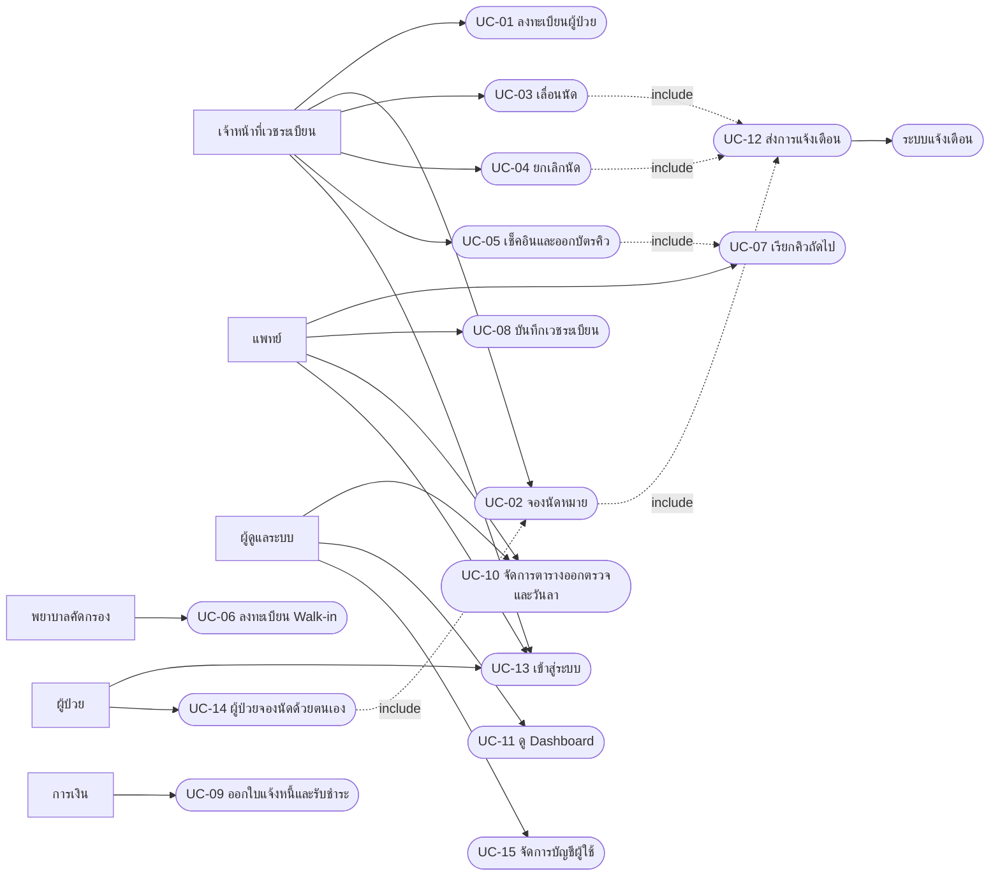
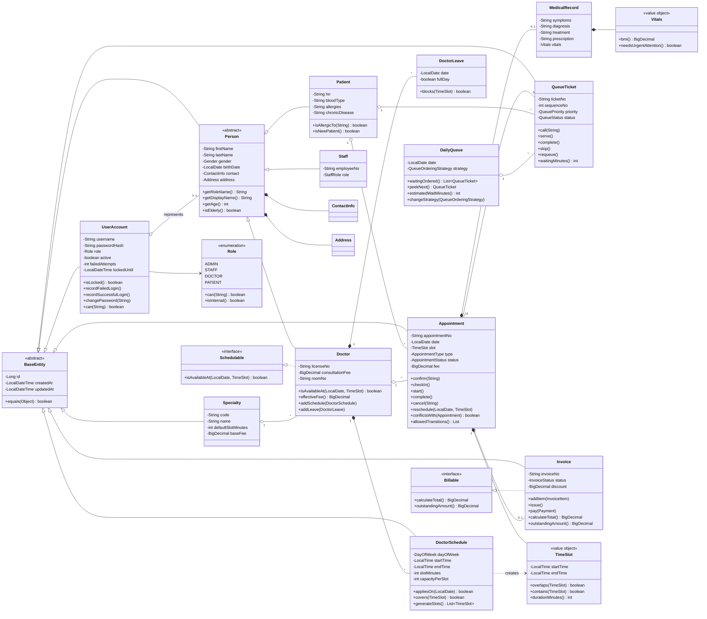
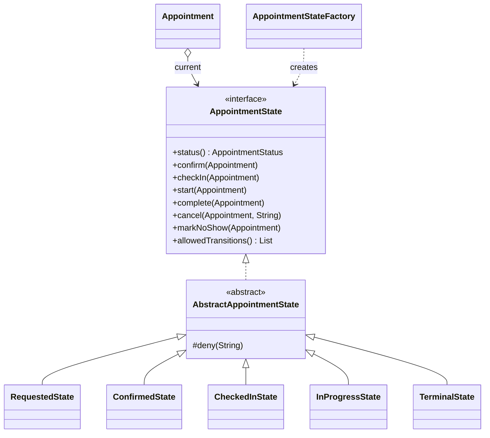
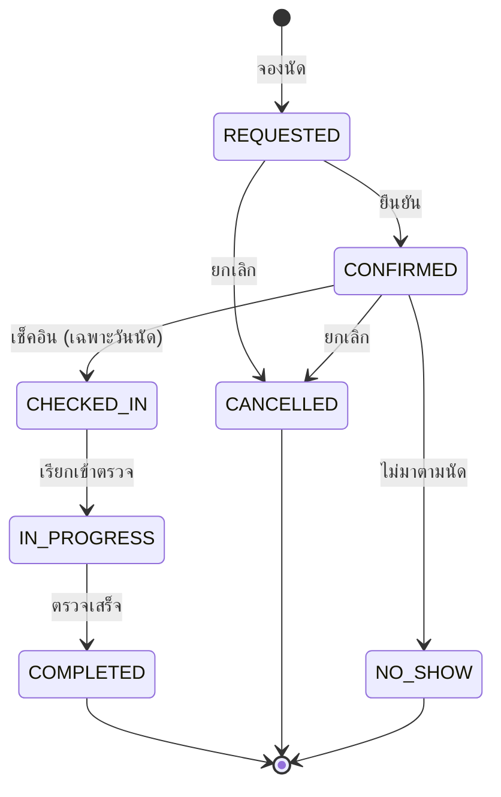
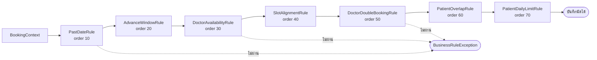
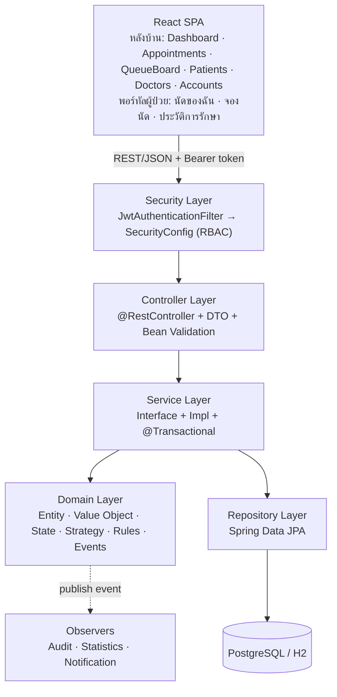
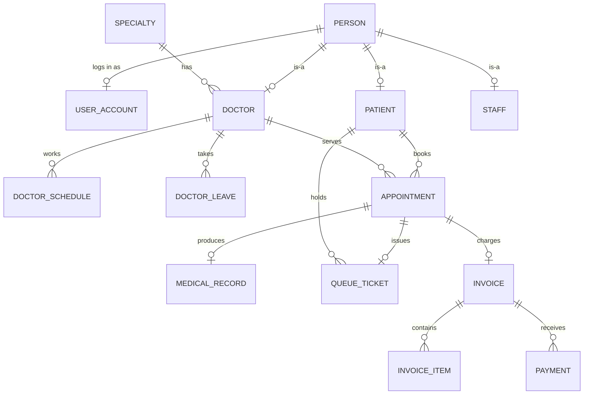
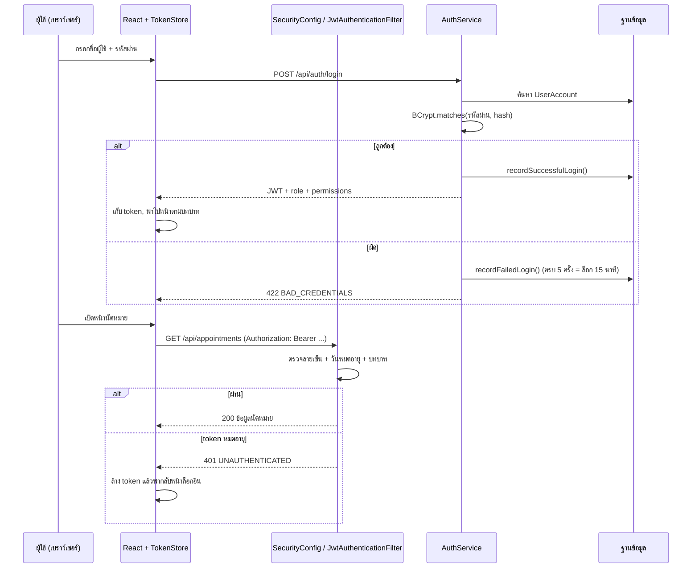
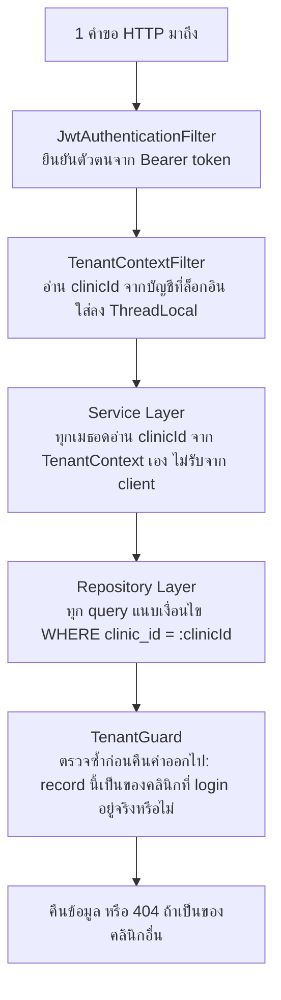
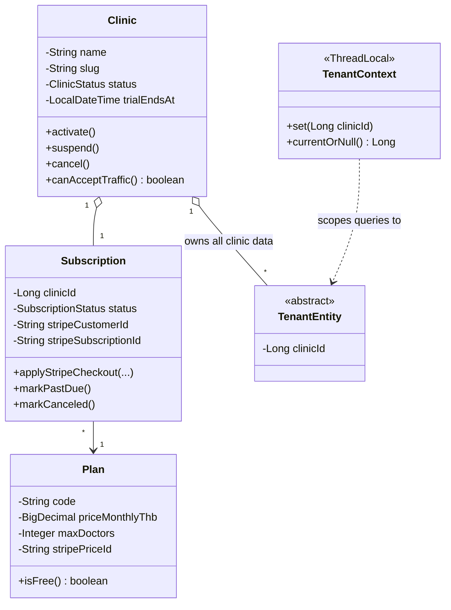

https://clinic-saas-system-gamma.vercel.app/super-admin
https://clinic-saas-system-gamma.vercel.app/login
# Clinic Appointment System — ระบบนัดหมายและจัดคิวคลินิก

โปรเจกต์ตัวอย่าง **Full-Stack Web Application ที่ออกแบบด้วยหลัก OOP อย่างเต็มรูปแบบ**
Backend เขียนด้วย Java + Spring Boot (Domain Model แบบ Rich Model ไม่ใช่ Anemic Model)
Frontend เขียนด้วย React + Vite

```
clinic/
├── backend/     Spring Boot 3.3 + Spring Security (JWT) + JPA + H2 (dev) / PostgreSQL (prod)
├── frontend/    React 18 + Vite 5 + React Router 6 (แยกหน้าจอหลังบ้านกับพอร์ทัลผู้ป่วย)
└── docs/        schema.sql สำหรับ PostgreSQL
```

---

## สารบัญ

1. [Problem](#1-problem)
2. [Actors](#2-actors)
3. [Functional Requirements](#3-functional-requirements)
4. [Use Cases](#4-use-cases)
5. [Classes (≥10)](#5-classes-10)
6. [Class Diagram](#6-class-diagram)
7. [Database Tables](#7-database-tables)
8. [REST API](#8-rest-api)
9. [OOP Concepts](#9-oop-concepts)
10. [Design Patterns](#10-design-patterns)
11. [Test Cases](#11-test-cases)
12. [Suggested Tech Stack](#12-suggested-tech-stack)
13. [ระบบล็อกอินและสิทธิ์การใช้งาน](#13-ระบบล็อกอินและสิทธิ์การใช้งาน)
14. [ระบบ Multi-tenant SaaS และการขายแพ็กเกจ](#14-ระบบ-multi-tenant-saas-และการขายแพ็กเกจ)
15. [วิธีติดตั้งและรัน](#15-วิธีติดตั้งและรัน)

---

## 1. Problem

คลินิกขนาดกลาง (แพทย์ 3–10 ท่าน หลายแผนก) ยังบริหารการนัดหมายด้วยสมุดจดและกระดาษบัตรคิว ทำให้เกิดปัญหาซ้ำ ๆ ดังนี้

| ปัญหา | ผลกระทบ |
|---|---|
| จองนัดชนกัน (Double booking) แพทย์คนเดียวถูกจองเวลาเดียวกัน 2 ราย | ผู้ป่วยรอนาน เสียความเชื่อมั่น |
| ไม่รู้ว่าแพทย์ว่างช่วงใด ต้องโทรถามหน้าเคาน์เตอร์ทุกครั้ง | เจ้าหน้าที่ทำงานซ้ำซ้อน |
| แพทย์ลากะทันหัน แต่ใบนัดเดิมยังอยู่ | ผู้ป่วยเดินทางมาเสียเที่ยว |
| คิว Walk-in กับคิวผู้ป่วยนัดปนกัน ไม่มีกติกาชัดเจน | ผู้ป่วยนัดหมายรู้สึกไม่เป็นธรรม เคสฉุกเฉินไม่ได้รับการจัดลำดับ |
| ไม่มีสถิติว่าวันไหนคนแน่น อัตรา No-show เท่าไร | วางแผนกำลังคนไม่ได้ |
| ค่าตรวจคิดด้วยมือ ผู้ป่วยเก่า/ใหม่/ฉุกเฉินคิดไม่เหมือนกัน | คิดเงินผิด ตรวจสอบย้อนหลังยาก |

**เป้าหมายของระบบ** คือสร้างระบบกลางที่
(1) บังคับกฎธุรกิจของการจองนัดไว้ที่ชั้น Domain ไม่ใช่ที่หน้าจอ
(2) จัดคิวหน้าห้องตรวจด้วยกลยุทธ์ที่สลับได้ตามนโยบายคลินิก
(3) ควบคุมวงจรชีวิตของใบนัดให้เปลี่ยนสถานะได้เฉพาะเส้นทางที่ถูกต้องเท่านั้น
(4) ต่อยอดไปสู่ระบบจริงได้ (เวชระเบียน การเงิน การแจ้งเตือน รายงาน)

**ขอบเขตที่ไม่รวมในเวอร์ชันนี้:** การเชื่อมต่อสิทธิประกัน/สปสช., ระบบคลังยา, Telemedicine แบบวิดีโอคอลจริง (มีเพียงประเภทนัด TELEMEDICINE)

---

## 2. Actors

| Actor | บทบาท | สิ่งที่ทำได้ในระบบ |
|---|---|---|
| **Patient (ผู้ป่วย)** | ผู้รับบริการ | ถูกลงทะเบียน มีเลข HN ประจำตัว ดูนัดหมายของตนเอง ถือบัตรคิว |
| **Receptionist / Staff (เจ้าหน้าที่เวชระเบียน)** | ผู้ใช้หลักหน้าเคาน์เตอร์ | ลงทะเบียนผู้ป่วยใหม่ จองนัด เลื่อนนัด ยกเลิกนัด เช็คอิน ออกบัตรคิว ลงทะเบียน Walk-in คิดเงิน |
| **Nurse (พยาบาลคัดกรอง)** | คัดกรองอาการ | กำหนดระดับความสำคัญของคิว (ฉุกเฉิน/ผู้สูงอายุ/ทั่วไป) บันทึกสัญญาณชีพ |
| **Doctor (แพทย์)** | ผู้ให้บริการตรวจ | กำหนดตารางออกตรวจ ลงวันลา เรียกคิว เริ่ม/จบการตรวจ บันทึกเวชระเบียน |
| **Cashier (การเงิน)** | ออกใบแจ้งหนี้ | สร้าง Invoice เพิ่มรายการ ออกบิล รับชำระเงิน |
| **Admin (ผู้ดูแลระบบ)** | ตั้งค่าระบบ | เพิ่มแผนก เพิ่มแพทย์ ตั้งค่ากฎการจอง เปลี่ยนกลยุทธ์คิว |
| **Notification System (ระบบภายนอก)** | Actor ประเภทระบบ | รับ Event จากระบบแล้วส่ง SMS/Email แจ้งผู้ป่วย |

ทุก Actor ที่เป็นคนต้องเข้าสู่ระบบด้วยบัญชีผู้ใช้ของตนเอง และระบบแบ่งสิทธิ์เป็น 4 บทบาท:
**ADMIN** (ผู้ดูแลระบบ) · **STAFF** (เจ้าหน้าที่เวชระเบียน/การเงิน) · **DOCTOR** (แพทย์) · **PATIENT** (ผู้ป่วย)
รายละเอียดอยู่ในหัวข้อ [ระบบล็อกอินและสิทธิ์การใช้งาน](#13-ระบบล็อกอินและสิทธิ์การใช้งาน)

---

## 3. Functional Requirements

### FR-1 จัดการผู้ป่วย
- FR-1.1 ลงทะเบียนผู้ป่วยใหม่ พร้อมออกเลข HN อัตโนมัติในรูปแบบ `HN-yyyy-NNNN`
- FR-1.2 ค้นหาผู้ป่วยจากชื่อ นามสกุล เลข HN หรือเบอร์โทร แบบแบ่งหน้า
- FR-1.3 แก้ไขข้อมูลติดต่อ ที่อยู่ ประวัติแพ้ยา โรคประจำตัว
- FR-1.4 ระบบต้องตรวจสอบเลขบัตรประชาชนซ้ำ และแจ้งเตือนเมื่อมีประวัติแพ้ยา
- FR-1.5 ดูประวัตินัดหมายและเวชระเบียนทั้งหมดของผู้ป่วยรายบุคคล

### FR-2 จัดการแพทย์และตารางออกตรวจ
- FR-2.1 เพิ่มแพทย์ ระบุแผนก เลขใบประกอบวิชาชีพ ค่าตรวจ ห้องตรวจ
- FR-2.2 กำหนดตารางออกตรวจรายสัปดาห์ (วัน เวลาเริ่ม–สิ้นสุด ความยาวช่องเวลา จำนวนคนต่อช่อง ช่วงวันที่มีผล)
- FR-2.3 ลบ/ปิดตารางออกตรวจ
- FR-2.4 ลงวันลาได้ทั้งแบบทั้งวันและเฉพาะช่วงเวลา
- FR-2.5 ระบบคำนวณ "ช่องเวลาว่าง" ของแพทย์ในวันที่ระบุให้อัตโนมัติ พร้อมเหตุผลของช่องที่จองไม่ได้

### FR-3 การนัดหมาย (หัวใจของระบบ)
- FR-3.1 จองนัดโดยเลือก ผู้ป่วย → แพทย์ → วันที่ → ช่องเวลา → ประเภทการเข้ารับบริการ
- FR-3.2 ระบบต้องตรวจกฎธุรกิจทุกข้อก่อนบันทึก (ดู [FR-4](#fr-4-กฎธุรกิจของการจอง))
- FR-3.3 ออกเลขที่นัด `AP-yyyyMMdd-NNN` อัตโนมัติ
- FR-3.4 ยืนยันนัด (Confirm)
- FR-3.5 เลื่อนนัด (Reschedule) โดยตรวจกฎชุดเดียวกับการจองครั้งแรก
- FR-3.6 ยกเลิกนัดพร้อมระบุเหตุผล
- FR-3.7 เช็คอินได้เฉพาะวันที่นัดจริงเท่านั้น และการเช็คอินต้องออกบัตรคิวให้อัตโนมัติ
- FR-3.8 เปลี่ยนสถานะเป็น กำลังตรวจ → ตรวจเสร็จ
- FR-3.9 บันทึก No-show เมื่อผู้ป่วยไม่มาตามนัด
- FR-3.10 ระบบต้องส่งรายการสถานะถัดไปที่ทำได้ (`allowedTransitions`) กลับไปให้หน้าจอ เพื่อให้ UI แสดงปุ่มตามความจริงของ Domain

### FR-4 กฎธุรกิจของการจอง
ต้องผ่านกฎทั้ง 7 ข้อตามลำดับ จึงจะบันทึกนัดได้

| ลำดับ | กฎ | เงื่อนไข |
|---|---|---|
| 10 | `PastDateRule` | ห้ามจองย้อนหลัง และต้องจองล่วงหน้าอย่างน้อย 30 นาที |
| 20 | `AdvanceWindowRule` | จองล่วงหน้าได้ไม่เกิน 60 วัน |
| 30 | `DoctorAvailabilityRule` | ต้องอยู่ในตารางออกตรวจ และแพทย์ต้องไม่ลาในช่วงเวลานั้น |
| 40 | `SlotAlignmentRule` | เวลาที่เลือกต้องตรงหัวช่องเวลาพอดี (เช่น ช่องละ 20 นาที ห้ามจอง 09:10) |
| 50 | `DoctorDoubleBookingRule` | แพทย์ต้องไม่มีนัดที่ยังไม่ถูกยกเลิกคาบเกี่ยวกัน เกินความจุต่อช่อง |
| 60 | `PatientOverlapRule` | ผู้ป่วยคนเดียวห้ามมีนัดเวลาคาบเกี่ยวกัน (แม้คนละแพทย์) |
| 70 | `PatientDailyLimitRule` | ผู้ป่วย 1 คน จองได้ไม่เกิน 2 นัดต่อวัน |

ค่าคงที่ทั้งหมดอ่านจาก `application.yml` ผ่าน `ClinicProperties` เปลี่ยนนโยบายได้โดยไม่ต้องแก้โค้ด

### FR-5 ระบบคิวหน้าห้องตรวจ
- FR-5.1 ออกบัตรคิวรูปแบบ `A001` แยกตามแพทย์และวัน
- FR-5.2 ลงทะเบียน Walk-in พร้อมกำหนดระดับความสำคัญจากการคัดกรอง
- FR-5.3 จัดลำดับคิวด้วยกลยุทธ์ที่สลับได้ 3 แบบ: FIFO, ตามลำดับความสำคัญ, ตามเวลานัดหมาย
- FR-5.4 เรียกคิวถัดไป / เรียกซ้ำ / เริ่มตรวจ / ปิดคิว / ข้ามคิว / นำคิวที่ข้ามกลับเข้าแถว
- FR-5.5 แสดงจอคิว: หมายเลขที่กำลังเรียก จำนวนคิวรอ จำนวนที่ตรวจเสร็จ และเวลารอโดยประมาณ
- FR-5.6 คิวฉุกเฉินต้องถูกจัดขึ้นหน้าสุดเสมอเมื่อใช้กลยุทธ์ความสำคัญ

### FR-6 เวชระเบียน
- FR-6.1 บันทึกสัญญาณชีพ (อุณหภูมิ ความดัน ชีพจร น้ำหนัก ส่วนสูง) ระบบคำนวณ BMI ให้
- FR-6.2 บันทึกอาการ การวินิจฉัย การรักษา ยาที่สั่ง และนัดติดตามครั้งถัดไป
- FR-6.3 เวชระเบียน 1 ใบผูกกับนัดหมาย 1 ใบเท่านั้น (One-to-One)
- FR-6.4 แจ้งเตือนเมื่อสัญญาณชีพเข้าเกณฑ์ที่ต้องดูแลเร่งด่วน

### FR-7 การเงิน
- FR-7.1 สร้างใบแจ้งหนี้จากนัดหมาย พร้อมคำนวณค่าตรวจตามนโยบายราคา
- FR-7.2 ราคาแตกต่างตามประเภท: ผู้ป่วยใหม่บวกค่าเปิดแฟ้ม, ผู้ป่วยติดตามอาการคิดครึ่งราคาและผู้สูงอายุลดเพิ่ม 10%, เคสฉุกเฉินนอกเวลาบวกค่าบริการ
- FR-7.3 เพิ่มรายการค่ายา/หัตถการ ใส่ส่วนลด ออกบิล รับชำระ (เงินสด/โอน/บัตร) และรองรับการชำระบางส่วน
- FR-7.4 ออกใบแจ้งหนี้เปล่า (ไม่มีรายการ) ไม่ได้

### FR-8 แจ้งเตือนและ Dashboard
- FR-8.1 เมื่อเกิดเหตุการณ์สำคัญ (จอง/ยืนยัน/เลื่อน/ยกเลิก/เรียกคิว) ระบบต้องประกาศ Event ให้ผู้สนใจทุกรายโดยอัตโนมัติ
- FR-8.2 ส่งแจ้งเตือนผ่าน Email และ SMS เปิด/ปิดแยกช่องทางได้
- FR-8.3 บันทึก Audit log ทุกเหตุการณ์
- FR-8.4 Dashboard แสดงจำนวนนัดวันนี้ จำนวนเช็คอินแล้ว คิวที่รออยู่ อัตรา No-show และภาระงานรายแพทย์

### FR-9 บัญชีผู้ใช้และการยืนยันตัวตน
- FR-9.1 เข้าสู่ระบบด้วยชื่อผู้ใช้และรหัสผ่าน ระบบออก JWT ที่มีอายุ 8 ชั่วโมง
- FR-9.2 รหัสผ่านต้องถูกเข้ารหัสด้วย BCrypt ห้ามเก็บรหัสผ่านดิบในฐานข้อมูล
- FR-9.3 กรอกรหัสผ่านผิดครบ 5 ครั้ง ระบบต้องล็อกบัญชีชั่วคราว 15 นาที
- FR-9.4 ผู้ป่วยสมัครใช้งานพอร์ทัลได้ด้วยตนเอง ระบบสร้างทั้งเวชระเบียนและบัญชีผู้ใช้ พร้อมออกเลข HN
- FR-9.5 ผู้ดูแลระบบสร้างบัญชีให้เจ้าหน้าที่/แพทย์/ผู้ป่วย ระงับบัญชี และตั้งรหัสผ่านใหม่ได้
- FR-9.6 ผู้ใช้เปลี่ยนรหัสผ่านของตนเองได้ และบัญชีที่ผู้ดูแลสร้างให้ต้องเปลี่ยนรหัสผ่านเมื่อเข้าใช้ครั้งแรก
- FR-9.7 แต่ละบทบาทเข้าถึงได้เฉพาะเมนูและ API ที่กำหนด โดยบังคับสิทธิ์ทั้งฝั่งหน้าจอและฝั่งเซิร์ฟเวอร์
- FR-9.8 ผู้ป่วยต้องเห็นเฉพาะข้อมูลของตนเองเท่านั้น (นัดหมาย ประวัติการรักษา) ไม่ว่าจะเรียก API ด้วยวิธีใด

### FR-10 พอร์ทัลผู้ป่วย
- FR-10.1 ดูนัดหมายที่กำลังจะถึงและประวัตินัดทั้งหมดของตนเอง
- FR-10.2 จองนัดด้วยตนเอง โดยเลือกแผนก → แพทย์ → วันที่ → ช่องเวลาว่าง
- FR-10.3 ยกเลิกหรือเลื่อนนัดของตนเอง ภายใต้กฎธุรกิจชุดเดียวกับเจ้าหน้าที่
- FR-10.4 ดูประวัติการรักษาและผลการวินิจฉัยของตนเอง

### Non-Functional (โดยย่อ)
- ข้อผิดพลาดทางธุรกิจต้องคืน HTTP status ที่สื่อความหมาย (401 / 403 / 404 / 409 / 422) พร้อมรหัสข้อผิดพลาดที่อ่านได้
- ระบบต้องเป็น stateless (ไม่พึ่ง session ฝั่งเซิร์ฟเวอร์) เพื่อรองรับการขยายเป็นหลายเครื่อง
- ทุก API มีเอกสาร OpenAPI อัตโนมัติผ่าน Swagger UI
- Domain Layer ต้องทดสอบได้โดยไม่ต้องยกฐานข้อมูล

---

## 4. Use Cases

### Use Case Diagram



### UC-02 จองนัดหมาย (Use Case หลัก — เขียนแบบละเอียด)

| หัวข้อ | รายละเอียด |
|---|---|
| **Actor หลัก** | เจ้าหน้าที่เวชระเบียน |
| **ผู้มีส่วนได้เสีย** | ผู้ป่วย (ต้องการเวลาที่สะดวก), แพทย์ (ไม่ต้องการคิวชนกัน) |
| **เงื่อนไขก่อน** | ผู้ป่วยมีอยู่ในระบบ, แพทย์มีตารางออกตรวจที่ยังมีผล |
| **เงื่อนไขหลัง** | มีใบนัดสถานะ `REQUESTED` ช่องเวลานั้นถูกจอง และมี Event `BOOKED` ถูกประกาศ |

**ลำดับเหตุการณ์หลัก**

1. เจ้าหน้าที่เลือกผู้ป่วยจากทะเบียน
2. เลือกแพทย์และวันที่ต้องการ
3. ระบบเรียก `GET /api/doctors/{id}/slots` คำนวณช่องเวลาทั้งหมดจากตารางออกตรวจ แล้วตรวจแต่ละช่องด้วยโซ่กฎการจอง ส่งกลับพร้อมสถานะว่าง/ไม่ว่างและเหตุผล
4. หน้าจอแสดงช่องเวลา ช่องที่จองไม่ได้จะถูกปิดและแสดงเหตุผลเมื่อชี้เมาส์
5. เจ้าหน้าที่เลือกช่องเวลา ระบุประเภทการเข้ารับบริการและอาการเบื้องต้น
6. กด "ยืนยันการจอง" → `POST /api/appointments`
7. `AppointmentServiceImpl` เรียก `BookingRuleChain.validate()` ตรวจกฎทั้ง 7 ข้อตามลำดับอีกครั้งที่ฝั่งเซิร์ฟเวอร์
8. `AppointmentFactory` สร้าง Aggregate `Appointment` ผ่าน Builder พร้อมเลขที่นัดจาก `DocumentNumberGenerator` และค่าตรวจจาก `FeeCalculator`
9. บันทึกลงฐานข้อมูล
10. `AppointmentEventPublisher` ประกาศ Event `BOOKED` → `AuditLogObserver`, `StatisticsObserver`, `PatientNotificationObserver` ทำงานทันที
11. ระบบคืนใบนัดพร้อม `allowedTransitions` ให้หน้าจอ

**ทางเลือก / ข้อยกเว้น**

- 3a. แพทย์ไม่ออกตรวจวันนั้น → คืนรายการช่องเวลาว่าง พร้อมข้อความ "แพทย์ไม่ออกตรวจ"
- 7a. กฎข้อใดข้อหนึ่งไม่ผ่าน → โยน `BusinessRuleException` คืน HTTP 422 พร้อมรหัสกฎ เช่น `SLOT_NOT_ALIGNED`
- 7b. ช่องเวลาถูกคนอื่นจองไปก่อน (race condition) → `DoubleBookingException` คืน HTTP 409
- 7c. ผู้ป่วยจองครบ 2 นัดในวันนั้นแล้ว → HTTP 422 `PATIENT_DAILY_LIMIT`

### UC-05 เช็คอินและออกบัตรคิว

1. ผู้ป่วยมาถึง เจ้าหน้าที่ค้นหาใบนัดของวันนี้
2. กด "เช็คอิน" → `PATCH /api/appointments/{id}/check-in`
3. Object สถานะปัจจุบันของใบนัด (`ConfirmedState`) ตรวจว่า **วันนี้ตรงกับวันนัดหรือไม่** ถ้าไม่ตรงจะปฏิเสธ
4. เปลี่ยนสถานะเป็น `CHECKED_IN`
5. `QueueService.issueTicketForAppointment()` ออกบัตรคิวหมายเลขถัดไปของแพทย์ท่านนั้นในวันนั้น โดยตั้งระดับความสำคัญเป็น `APPOINTMENT` (หรือ `ELDERLY` ถ้าผู้ป่วยอายุ 60 ปีขึ้นไป)
6. คืนเลขบัตรคิวให้แสดงบนหน้าจอและในใบนัด

**ข้อยกเว้น:** 3a. เช็คอินก่อนยืนยันนัด หรือเช็คอินผิดวัน → `InvalidAppointmentStateException` (HTTP 409)

### UC-07 เรียกคิวถัดไป

1. แพทย์/เจ้าหน้าที่หน้าห้องกด "เรียกคิวถัดไป" ระบุหมายเลขห้อง
2. ระบบสร้าง `DailyQueue` จากบัตรคิวทั้งหมดของแพทย์ในวันนั้น
3. `QueueStrategyFactory` คืน Strategy ตามที่เลือก (FIFO / Priority / Appointment time)
4. `DailyQueue.peekNext()` ใช้ Strategy จัดลำดับแล้วคืนบัตรใบถัดไป
5. เปลี่ยนสถานะบัตรเป็น `CALLED` บันทึกเวลาเรียกและหมายเลขห้อง
6. ประกาศ Event `QUEUE_CALLED` เพื่อขึ้นจอและประกาศเสียง

**ข้อยกเว้น:** 4a. ไม่มีคิวรอ → HTTP 422 `QUEUE_EMPTY`

### UC-13 เข้าสู่ระบบ

1. ผู้ใช้เปิดหน้าเว็บ ระบบพบว่ายังไม่มี token ที่ใช้ได้ จึงพาไปหน้า `/login`
2. ผู้ใช้เลือกแท็บ "เจ้าหน้าที่ / แพทย์" หรือ "ผู้ป่วย" แล้วกรอกชื่อผู้ใช้และรหัสผ่าน
3. `POST /api/auth/login` → `AuthServiceImpl` ค้นหาบัญชี ตรวจว่ายังใช้งานได้และไม่ถูกล็อก
4. เทียบรหัสผ่านด้วย `PasswordEncoder` (BCrypt)
5. สำเร็จ → `UserAccount.recordSuccessfulLogin()` ล้างตัวนับและบันทึกเวลาเข้าใช้ล่าสุด
6. `JwtTokenService` ออก token ที่บรรจุ `username`, `role`, `personId` อายุ 8 ชั่วโมง
7. หน้าเว็บเก็บ token ไว้ แล้วพาไป `/dashboard` (บุคลากร) หรือ `/portal` (ผู้ป่วย) ตามบทบาท

**ทางเลือก / ข้อยกเว้น**
- 4a. รหัสผ่านผิด → `UserAccount.recordFailedLogin()` แล้วคืน 422 `BAD_CREDENTIALS` (ไม่บอกว่าผิดที่ชื่อผู้ใช้หรือรหัสผ่าน เพื่อไม่ให้เดาบัญชีได้)
- 4b. ผิดครบ 5 ครั้ง → ล็อกบัญชี 15 นาที คืน `ACCOUNT_LOCKED`
- 3a. บัญชีถูกระงับโดยผู้ดูแล → `ACCOUNT_DISABLED`
- ทุกคำขอถัดไปแนบ `Authorization: Bearer <token>`; `JwtAuthenticationFilter` ตรวจทุกครั้ง หากหมดอายุจะได้ 401 และหน้าเว็บจะพากลับหน้าล็อกอินอัตโนมัติ

### UC-14 ผู้ป่วยจองนัดด้วยตนเอง

1. ผู้ป่วยที่ล็อกอินแล้วเปิดเมนู "จองนัดใหม่"
2. เลือกแผนก → ระบบกรองรายชื่อแพทย์ → เลือกแพทย์และวันที่
3. `GET /api/portal/doctors/{id}/slots?date=` — **สังเกตว่าไม่มี `patientId` ใน URL** ระบบอ่าน id ของผู้ป่วยจาก token เอง
4. เลือกช่องเวลา ระบุอาการ แล้วกดยืนยัน → `POST /api/portal/appointments`
5. `PortalController` ประกอบ `BookAppointmentRequest` โดยใส่ `patientId` ของเจ้าของ token แล้วส่งต่อให้ `AppointmentService` ตัวเดียวกับที่เจ้าหน้าที่ใช้ → กฎธุรกิจทั้ง 7 ข้อถูกบังคับเหมือนกันทุกประการ

**ข้อยกเว้น:** 4a. ผู้ป่วยพยายามยกเลิกนัดของคนอื่นโดยแก้ id ใน URL → `CurrentUser.assertCanAccessPatient()` ปฏิเสธด้วย `FORBIDDEN_PATIENT_DATA`

### Use Cases ที่เหลือโดยย่อ

| รหัส | ชื่อ | Actor | ผลลัพธ์ |
|---|---|---|---|
| UC-01 | ลงทะเบียนผู้ป่วย | เจ้าหน้าที่ | ได้เลข HN ใหม่ ตรวจเลขบัตรซ้ำ |
| UC-03 | เลื่อนนัด | เจ้าหน้าที่ | ใบนัดเดิมย้ายไปเวลาใหม่ ผ่านกฎชุดเดิม + แจ้งผู้ป่วย |
| UC-04 | ยกเลิกนัด | เจ้าหน้าที่ | สถานะ `CANCELLED` พร้อมเหตุผล ช่องเวลาถูกคืนสู่ระบบ |
| UC-06 | ลงทะเบียน Walk-in | พยาบาล | ได้บัตรคิวพร้อมระดับความสำคัญจากการคัดกรอง |
| UC-08 | บันทึกเวชระเบียน | แพทย์ | เวชระเบียนผูกกับใบนัด + คำนวณ BMI |
| UC-09 | ออกใบแจ้งหนี้/รับชำระ | การเงิน | Invoice → ISSUED → PAID หรือ PARTIALLY_PAID |
| UC-10 | จัดการตารางออกตรวจ/วันลา | แพทย์, Admin | ช่องเวลาว่างเปลี่ยนตามทันที |
| UC-11 | ดู Dashboard | Admin | สถิติวันนี้และภาระงานรายแพทย์ |
| UC-12 | ส่งการแจ้งเตือน | ระบบ | Email/SMS ตามเหตุการณ์ |
| UC-15 | จัดการบัญชีผู้ใช้ | Admin | สร้าง/ระงับ/ตั้งรหัสผ่านใหม่ พร้อมกำหนดบทบาท |
| UC-16 | สมัครสมาชิกผู้ป่วย | ผู้ป่วย | ได้ทั้งเวชระเบียน เลข HN และบัญชีเข้าใช้พอร์ทัล |
| UC-17 | เปลี่ยนรหัสผ่าน | ทุกบทบาท | ตรวจรหัสผ่านเดิมก่อนเปลี่ยนเสมอ |

---

## 5. Classes (≥10)

ระบบมีคลาสทั้งหมดมากกว่า 130 คลาส ตารางนี้คัดเฉพาะคลาสแกนของ Domain Layer

| # | คลาส | ชนิด | ความรับผิดชอบ (Responsibility) | ความสัมพันธ์สำคัญ |
|---|---|---|---|---|
| 1 | `Person` | abstract class | ข้อมูลร่วมของบุคคล: ชื่อ เพศ วันเกิด ข้อมูลติดต่อ ที่อยู่ คำนวณอายุ และ `isElderly()` | ซูเปอร์คลาสของ `Patient`, `Doctor`, `Staff` (JOINED inheritance) |
| 2 | `Patient` | class | ผู้ป่วย: เลข HN, กรุ๊ปเลือด, ประวัติแพ้ยา, โรคประจำตัว, `isAllergicTo()`, `isNewPatient()` | `Patient 1 — * Appointment`, `1 — * MedicalRecord`, `1 — * QueueTicket` |
| 3 | `Doctor` | class | แพทย์: ใบประกอบวิชาชีพ ค่าตรวจ ห้องตรวจ `isAvailableAt()` `effectiveFee()` | `Doctor * — 1 Specialty`, `1 — * DoctorSchedule`, `1 — * DoctorLeave`, `1 — * Appointment` |
| 4 | `Specialty` | class | แผนก/สาขาเฉพาะทาง: รหัส ชื่อ ความยาวช่องเวลามาตรฐาน ค่าตรวจพื้นฐาน | `1 — * Doctor` |
| 5 | `DoctorSchedule` | class | ตารางออกตรวจรายสัปดาห์ และ **สร้างช่องเวลา** ด้วย `generateSlots()`; `appliesOn(date)`, `covers(slot)` | `* — 1 Doctor`, สร้าง `TimeSlot` |
| 6 | `DoctorLeave` | class | วันลาของแพทย์ ทั้งวันหรือเฉพาะช่วง `blocks(slot)` | `* — 1 Doctor` |
| 7 | `Appointment` | class (Aggregate Root) | ใบนัด: เลขที่นัด วันเวลา ประเภท สถานะ ค่าตรวจ; `conflictsWith()`, `reschedule()`, `confirm()/checkIn()/start()/complete()/cancel()` ผ่าน State | `* — 1 Patient`, `* — 1 Doctor`, `1 — 0..1 MedicalRecord`, `1 — 0..1 QueueTicket`, `1 — 0..1 Invoice` |
| 8 | `AppointmentState` | interface (+5 implementations) | ตัดสินใจว่าสถานะปัจจุบันอนุญาตให้เปลี่ยนไปสถานะใดได้บ้าง | ถูกใช้โดย `Appointment`, สร้างโดย `AppointmentStateFactory` |
| 9 | `TimeSlot` | Value Object (immutable) | ช่วงเวลาเริ่ม–สิ้นสุด `overlaps()`, `contains()`, `durationMinutes()` | ใช้ร่วมกันทั้ง `DoctorSchedule`, `Appointment`, `BookingRule` |
| 10 | `QueueTicket` | class | บัตรคิว: เลขบัตร ลำดับ ความสำคัญ สถานะ เวลาออก/เรียก `call()`, `serve()`, `complete()`, `skip()`, `requeue()` | `* — 1 Patient`, `* — 1 Doctor`, `0..1 — 1 Appointment` |
| 11 | `DailyQueue` | class (Aggregate) | คิวของแพทย์ 1 ท่านใน 1 วัน จัดลำดับด้วย Strategy `peekNext()`, `estimatedWaitMinutes()`, `changeStrategy()` | ประกอบด้วย `QueueTicket` หลายใบ, ถือ `QueueOrderingStrategy` |
| 12 | `QueueOrderingStrategy` | interface (+3 implementations) | กติกาการจัดลำดับคิว: FIFO / Priority / Appointment time | ใช้โดย `DailyQueue`, สร้างโดย `QueueStrategyFactory` |
| 13 | `BookingRule` | interface (+7 implementations) | กฎการจอง 1 ข้อ ตรวจแล้วส่งต่อให้กฎถัดไป | ประกอบกันเป็น `BookingRuleChain` |
| 14 | `MedicalRecord` | class | เวชระเบียน: อาการ วินิจฉัย การรักษา ยา นัดติดตาม | `1 — 1 Appointment`, `* — 1 Patient`, ประกอบ `Vitals` |
| 15 | `Vitals` | Value Object | สัญญาณชีพ `bmi()`, `hasFever()`, `needsUrgentAttention()` | ฝังใน `MedicalRecord` (`@Embeddable`) |
| 16 | `Invoice` | class (Aggregate Root) | ใบแจ้งหนี้ `addItem()`, `applyDiscount()`, `issue()`, `pay()`, `outstandingAmount()` | `1 — * InvoiceItem`, `1 — * Payment`, `1 — 1 Appointment` |
| 17 | `PricingStrategy` | interface (+3 implementations) | นโยบายคิดค่าตรวจตามประเภทผู้ป่วย/นัด | ใช้ผ่าน `FeeCalculator` |
| 18 | `AppointmentEventPublisher` | class (Subject) | ประกาศเหตุการณ์ไปยัง Observer ทุกตัวที่ลงทะเบียนไว้ | `1 — * AppointmentObserver` |
| 19 | `NotificationSender` | interface + abstract | โครงการส่งแจ้งเตือนแบบ Template Method | `EmailNotificationSender`, `SmsNotificationSender` |
| 20 | `ContactInfo` / `Address` | Value Objects | ข้อมูลติดต่อและที่อยู่ พร้อม `maskedPhone()` | ฝังใน `Person` |
| 21 | `UserAccount` | class | บัญชีผู้ใช้: ชื่อผู้ใช้ รหัสผ่านที่เข้ารหัสแล้ว บทบาท และการล็อกบัญชี `recordFailedLogin()`, `recordSuccessfulLogin()`, `changePassword()`, `isLocked()` | `UserAccount * — 0..1 Person` (บัญชีผูกกับผู้ป่วย/แพทย์/เจ้าหน้าที่) |
| 22 | `Role` | enum | บทบาทและชุดสิทธิ์ของแต่ละบทบาท `can(permission)`, `isInternal()`, `authority()` | ถือโดย `UserAccount` ใช้โดย `SecurityConfig` |
| 23 | `AppUserPrincipal` | class (Adapter) | แปลง `UserAccount` เป็น `UserDetails` ของ Spring Security | ห่อ `UserAccount`, ใช้โดย `JwtAuthenticationFilter` |
| 24 | `JwtTokenService` | class | ออกและตรวจสอบ JWT | ใช้โดย `AuthServiceImpl` และ filter |
| 25 | `CurrentUser` | class | อ่านผู้ใช้ที่ล็อกอินอยู่ และตรวจความเป็นเจ้าของข้อมูล `assertCanAccessPatient()` | ใช้โดย `PortalController` |

---

## 6. Class Diagram

### 6.1 ภาพรวม Domain Model



### 6.2 State Pattern ของใบนัด



### 6.3 วงจรชีวิตของใบนัด (State Machine)



### 6.4 Chain of Responsibility ของกฎการจอง



### 6.5 สถาปัตยกรรมแบบชั้น



---

## 7. Database Tables

ใช้ **JOINED inheritance**: `person` เก็บข้อมูลร่วม ส่วน `patient`, `doctor`, `staff` เก็บเฉพาะฟิลด์ของตัวเองและใช้ `id` เดียวกันเป็น PK/FK

| ตาราง | คอลัมน์หลัก | คำอธิบาย |
|---|---|---|
| **person** | `id` PK, `first_name`, `last_name`, `gender`, `birth_date`, `national_id` UNIQUE, `phone`, `email`, `address_line`, `district`, `province`, `postcode`, `created_at`, `updated_at` | ข้อมูลบุคคลร่วม |
| **patient** | `id` PK/FK→person, `hn` UNIQUE, `blood_type`, `allergies`, `chronic_disease`, `emergency_contact` | ผู้ป่วย |
| **doctor** | `id` PK/FK→person, `license_no` UNIQUE, `specialty_id` FK→specialty, `consultation_fee`, `room_no`, `biography`, `active` | แพทย์ |
| **staff** | `id` PK/FK→person, `employee_no` UNIQUE, `role`, `active` | เจ้าหน้าที่ |
| **specialty** | `id` PK, `code` UNIQUE, `name`, `default_slot_minutes`, `base_fee` | แผนก |
| **doctor_schedule** | `id` PK, `doctor_id` FK, `day_of_week`, `start_time`, `end_time`, `slot_minutes`, `capacity_per_slot`, `room_no`, `effective_from`, `effective_to`, `active` — UNIQUE(`doctor_id`,`day_of_week`,`start_time`) | ตารางออกตรวจ |
| **doctor_leave** | `id` PK, `doctor_id` FK, `leave_date`, `full_day`, `start_time`, `end_time`, `reason` | วันลา |
| **appointment** | `id` PK, `appointment_no` UNIQUE, `patient_id` FK, `doctor_id` FK, `appointment_date`, `start_time`, `end_time`, `type`, `status`, `symptom_note`, `cancel_reason`, `fee`, `created_by`, `checked_in_at`, `started_at`, `completed_at` — UNIQUE(`doctor_id`,`appointment_date`,`start_time`) เมื่อยังไม่ถูกยกเลิก, INDEX(`appointment_date`,`status`) | ใบนัด |
| **queue_ticket** | `id` PK, `ticket_no`, `queue_date`, `doctor_id` FK, `patient_id` FK, `appointment_id` FK NULL, `priority`, `status`, `sequence_no`, `issued_at`, `called_at`, `served_at`, `completed_at`, `counter_no` — UNIQUE(`doctor_id`,`queue_date`,`sequence_no`) | บัตรคิว |
| **medical_record** | `id` PK, `appointment_id` FK UNIQUE, `patient_id` FK, `doctor_id` FK, `symptoms`, `diagnosis`, `treatment`, `prescription`, `follow_up_date`, `temperature`, `systolic`, `diastolic`, `pulse`, `weight_kg`, `height_cm` | เวชระเบียน (สัญญาณชีพฝังในตารางเดียวกันแบบ `@Embeddable`) |
| **invoice** | `id` PK, `invoice_no` UNIQUE, `appointment_id` FK, `patient_id` FK, `status`, `discount`, `issued_at`, `paid_at` | ใบแจ้งหนี้ |
| **invoice_item** | `id` PK, `invoice_id` FK, `description`, `quantity`, `unit_price` | รายการในใบแจ้งหนี้ |
| **payment** | `id` PK, `invoice_id` FK, `amount`, `method`, `paid_at`, `reference_no` | การชำระเงิน |
| **user_account** | `id` PK, `username` UNIQUE, `password_hash` (BCrypt), `role`, `person_id` FK→person UNIQUE, `display_name`, `active`, `failed_attempts`, `locked_until`, `last_login_at`, `must_change_password` | บัญชีผู้ใช้ — 1 บัญชีต่อ 1 บุคคล (ผู้ดูแลระบบอาจไม่ผูกกับบุคคลก็ได้) |

### ER Diagram



ไฟล์ DDL สำหรับ PostgreSQL อยู่ที่ `docs/schema.sql`

---

## 8. REST API

Base URL: `http://localhost:8080/api` — เอกสารอัตโนมัติที่ `http://localhost:8080/swagger-ui.html`

### 8.0 ยืนยันตัวตน (`/api/auth`)

| Method | Endpoint | สิทธิ์ | คำอธิบาย |
|---|---|---|---|
| POST | `/auth/login` | สาธารณะ | เข้าสู่ระบบ คืน JWT + บทบาท + สิทธิ์ |
| POST | `/auth/register` | สาธารณะ | ผู้ป่วยสมัครใช้งานเอง (สร้างเวชระเบียน + บัญชี + ออก HN) |
| GET | `/auth/me` | ทุกบทบาทที่ล็อกอิน | ข้อมูลบัญชีตนเอง ใช้ตรวจว่า token ยังใช้ได้ |
| POST | `/auth/change-password` | ทุกบทบาทที่ล็อกอิน | เปลี่ยนรหัสผ่านตนเอง |

ตัวอย่างการเรียก:

```bash
# 1) เข้าสู่ระบบ
curl -X POST http://localhost:8080/api/auth/login \
     -H "Content-Type: application/json" \
     -d '{"username":"staff","password":"Clinic@123"}'

# 2) นำ token ไปใช้กับ endpoint อื่น
curl http://localhost:8080/api/appointments?date=2026-09-19 \
     -H "Authorization: Bearer <token ที่ได้จากขั้นที่ 1>"
```

### 8.0.1 จัดการบัญชีผู้ใช้ (`/api/admin/accounts`) — เฉพาะ ADMIN

| Method | Endpoint | คำอธิบาย |
|---|---|---|
| GET | `/admin/accounts` | รายการบัญชีทั้งหมด |
| POST | `/admin/accounts` | สร้างบัญชีใหม่ พร้อมกำหนดบทบาทและบุคคลที่ผูก |
| PATCH | `/admin/accounts/{id}/activate` | เปิดใช้งานบัญชี |
| PATCH | `/admin/accounts/{id}/deactivate` | ระงับบัญชี |
| PATCH | `/admin/accounts/{id}/reset-password` | ตั้งรหัสผ่านใหม่ (บังคับเปลี่ยนเมื่อเข้าใช้ครั้งถัดไป) |

### 8.0.2 พอร์ทัลผู้ป่วย (`/api/portal`) — เฉพาะ PATIENT

ทุก endpoint อ่าน `patientId` จาก token ไม่รับจากภายนอก จึงเข้าถึงข้อมูลของผู้อื่นไม่ได้

| Method | Endpoint | คำอธิบาย |
|---|---|---|
| GET | `/portal/profile` | ข้อมูลผู้ป่วยของตนเอง |
| GET | `/portal/appointments` | นัดหมายของตนเองทั้งหมด |
| GET | `/portal/specialties` | รายการแผนก |
| GET | `/portal/doctors?specialtyId=` | รายชื่อแพทย์ |
| GET | `/portal/doctors/{id}/slots?date=` | ช่องเวลาว่าง |
| POST | `/portal/appointments` | จองนัดด้วยตนเอง |
| PATCH | `/portal/appointments/{id}/cancel` | ยกเลิกนัดของตนเอง |
| PATCH | `/portal/appointments/{id}/reschedule` | เลื่อนนัดของตนเอง |
| GET | `/portal/medical-records` | ประวัติการรักษาของตนเอง |

### 8.1 ผู้ป่วย

| Method | Endpoint | คำอธิบาย |
|---|---|---|
| GET | `/patients?q=&page=&size=` | ค้นหาผู้ป่วยแบบแบ่งหน้า |
| GET | `/patients/{id}` | ดูผู้ป่วยรายคน |
| GET | `/patients/hn/{hn}` | ค้นด้วยเลข HN |
| POST | `/patients` | ลงทะเบียนผู้ป่วยใหม่ (ออก HN อัตโนมัติ) |
| PUT | `/patients/{id}` | แก้ไขข้อมูลผู้ป่วย |
| GET | `/patients/{id}/appointments` | ประวัตินัดหมายของผู้ป่วย |
| GET | `/patients/{id}/medical-records` | ประวัติเวชระเบียน |

### 8.2 แพทย์และตารางออกตรวจ

| Method | Endpoint | คำอธิบาย |
|---|---|---|
| GET | `/doctors?specialtyId=` | รายชื่อแพทย์ (กรองตามแผนก) |
| GET | `/doctors/{id}` | ข้อมูลแพทย์พร้อมตารางออกตรวจ |
| POST | `/doctors` | เพิ่มแพทย์ |
| POST | `/doctors/{id}/schedules` | เพิ่มตารางออกตรวจ |
| DELETE | `/doctors/{id}/schedules/{scheduleId}` | ลบตารางออกตรวจ |
| POST | `/doctors/{id}/leaves` | ลงวันลา |
| GET | `/doctors/{id}/slots?date=&patientId=` | **ช่องเวลาว่าง** พร้อมเหตุผลของช่องที่จองไม่ได้ |

### 8.3 นัดหมาย

| Method | Endpoint | คำอธิบาย |
|---|---|---|
| GET | `/appointments?date=` | นัดหมายทั้งหมดของวันที่ระบุ |
| GET | `/appointments/{id}` | ดูใบนัด |
| POST | `/appointments` | จองนัด (ผ่านกฎทั้ง 7 ข้อ) |
| PATCH | `/appointments/{id}/confirm` | ยืนยันนัด |
| PATCH | `/appointments/{id}/reschedule` | เลื่อนนัด |
| PATCH | `/appointments/{id}/cancel` | ยกเลิกนัด (ต้องมีเหตุผล) |
| PATCH | `/appointments/{id}/check-in` | เช็คอิน + ออกบัตรคิวอัตโนมัติ |
| PATCH | `/appointments/{id}/start` | เริ่มตรวจ |
| PATCH | `/appointments/{id}/complete` | ตรวจเสร็จ |
| PATCH | `/appointments/{id}/no-show` | บันทึกไม่มาตามนัด |
| GET | `/appointments/{id}/medical-record` | ดูเวชระเบียนของนัดนี้ |
| PUT | `/appointments/{id}/medical-record` | บันทึก/แก้ไขเวชระเบียน |

### 8.4 คิว

| Method | Endpoint | คำอธิบาย |
|---|---|---|
| GET | `/queues/board?doctorId=&date=&strategy=` | ข้อมูลจอคิวทั้งหมด |
| POST | `/queues/walk-in` | ลงทะเบียน Walk-in และออกบัตรคิว |
| POST | `/queues/call-next?doctorId=` | เรียกคิวถัดไป |
| PATCH | `/queues/tickets/{ticketId}/recall` | เรียกซ้ำ |
| PATCH | `/queues/tickets/{ticketId}/serve` | เริ่มตรวจ |
| PATCH | `/queues/tickets/{ticketId}/complete` | ปิดคิว |
| PATCH | `/queues/tickets/{ticketId}/skip` | ข้ามคิว |
| PATCH | `/queues/tickets/{ticketId}/requeue` | นำคิวที่ข้ามกลับเข้าแถว |
| GET | `/queues/strategies` | รายชื่อกลยุทธ์จัดคิวที่ใช้ได้ |

### 8.5 การเงินและข้อมูลอ้างอิง

| Method | Endpoint | คำอธิบาย |
|---|---|---|
| POST | `/invoices?appointmentId=` | สร้างใบแจ้งหนี้จากนัดหมาย |
| GET | `/invoices/by-appointment/{appointmentId}` | ดูใบแจ้งหนี้ของนัด |
| POST | `/invoices/{id}/items` | เพิ่มรายการค่ายา/หัตถการ |
| PATCH | `/invoices/{id}/issue` | ออกบิล |
| POST | `/invoices/{id}/payments` | รับชำระเงิน |
| GET | `/specialties` | รายการแผนก |
| GET | `/appointment-types` | ประเภทการเข้ารับบริการ |
| GET | `/queue-priorities` | ระดับความสำคัญของคิว |
| GET | `/dashboard?date=` | สถิติภาพรวมประจำวัน |

### 8.6 รูปแบบข้อผิดพลาด

```json
{
  "code": "SLOT_NOT_ALIGNED",
  "message": "เวลาที่เลือกไม่ตรงกับช่องเวลาของแพทย์ (ช่องละ 20 นาที)",
  "details": [],
  "timestamp": "2026-09-19T10:32:11"
}
```

| HTTP | ความหมาย | ตัวอย่างสถานการณ์ |
|---|---|---|
| 400 | ข้อมูลที่ส่งมาไม่ครบ/ผิดรูปแบบ | Bean Validation ไม่ผ่าน |
| 401 | ยังไม่ได้เข้าสู่ระบบ หรือ token หมดอายุ | `UNAUTHENTICATED` |
| 403 | เข้าสู่ระบบแล้วแต่บทบาทไม่มีสิทธิ์ | ผู้ป่วยเรียก `/api/patients` |
| 404 | ไม่พบทรัพยากร | `ResourceNotFoundException` |
| 409 | ขัดแย้งกับสถานะปัจจุบัน | `InvalidAppointmentStateException`, `DoubleBookingException` |
| 422 | ผิดกฎธุรกิจ | `BusinessRuleException` จากโซ่กฎการจอง |

---

## 9. OOP Concepts

### 9.1 Encapsulation (การห่อหุ้ม)

ฟิลด์ทุกตัวเป็น `private` และไม่มี setter สาธารณะที่ทำลายความคงเส้นคงวาของข้อมูล การเปลี่ยนแปลงสถานะทำผ่านเมธอดที่สื่อความหมายทางธุรกิจเท่านั้น

```java
// ❌ แบบที่ระบบนี้ "ไม่" ทำ
appointment.setStatus(AppointmentStatus.COMPLETED);

// ✅ แบบที่ระบบนี้ทำ — Object ปกป้องกฎของตัวเอง
appointment.complete();   // จะโยน exception ทันทีถ้ายังไม่เคย start()
```

ตัวอย่างอื่น: `Invoice.addItem()` ปฏิเสธการเพิ่มรายการหลังออกบิลแล้ว, `QueueTicket.call()` ตั้งเวลาเรียกให้เองโดยภายนอกกำหนดไม่ได้

เรื่องความปลอดภัยก็ใช้หลักเดียวกัน — `UserAccount` ไม่มี `setFailedAttempts()` หรือ `setPasswordHash()` สาธารณะ:

```java
// นโยบายล็อกบัญชีอยู่ในตัว object เอง service เพียงแค่บอกว่า "ล็อกอินไม่สำเร็จ"
account.recordFailedLogin();   // ครบ 5 ครั้งเมื่อใด object จะล็อกตัวเอง 15 นาที
```

### 9.2 Inheritance (การสืบทอด)

- `BaseEntity` → เก็บ `id` และ audit fields ให้ทุก Entity ใช้ร่วมกัน
- `Person` (abstract) → `Patient`, `Doctor`, `Staff` ใช้กลยุทธ์ `InheritanceType.JOINED` ทำให้ระดับฐานข้อมูลก็เป็นการสืบทอดจริง
- `AbstractAppointmentState` → State ย่อย 5 ตัว โดยคลาสแม่กำหนด "ปฏิเสธทุกอย่าง" เป็นค่าเริ่มต้น คลาสลูกจึง override เฉพาะสิ่งที่ตนอนุญาต ลดโค้ดซ้ำและปลอดภัยโดยปริยาย
- `AbstractBookingRule` → กฎย่อย 7 ตัว
- `AbstractNotificationSender` → `EmailNotificationSender`, `SmsNotificationSender`

### 9.3 Polymorphism (พหุสัณฐาน)

```java
// Runtime polymorphism — Appointment ไม่รู้เลยว่าตอนนี้ตัวเองเป็น state ไหน
private AppointmentState currentState() {
    return AppointmentStateFactory.of(this.status);
}
public void checkIn() { currentState().checkIn(this); }
```

ที่อื่นในระบบ:
- `QueueOrderingStrategy` — เปลี่ยนกติกาคิวได้ขณะทำงานโดย `DailyQueue` ไม่ต้องรู้จักคลาสลูก
- `PricingStrategy` — คิดราคาคนละแบบผ่าน interface เดียวกัน
- `NotificationSender` — ส่งข้อความคนละช่องทางด้วยสัญญาเดียวกัน
- `Person.getRoleName()` — abstract method ที่ subclass ตอบต่างกัน

### 9.4 Abstraction (นามธรรม)

- `Schedulable` — "สิ่งที่นัดเวลาได้" วันนี้คือแพทย์ อนาคตอาจเป็นห้องผ่าตัดหรือเครื่องเอกซเรย์ โดยโค้ดที่ตรวจความว่างไม่ต้องแก้
- `Billable` — "สิ่งที่เรียกเก็บเงินได้"
- `BookingRule` — ซ่อนรายละเอียดของกฎแต่ละข้อไว้หลัง interface เดียว
- Service Layer ประกาศเป็น interface (`AppointmentService`) แล้วมี `AppointmentServiceImpl` เป็นผู้ใช้งานจริง Controller ขึ้นต่อ interface เท่านั้น

### 9.5 Composition และ Aggregation

- **Composition (ตายตาม):** `Appointment` *—* `MedicalRecord` (`cascade = ALL, orphanRemoval = true`), `Invoice` *—* `InvoiceItem`, `Person` *—* `ContactInfo`/`Address`
- **Aggregation (อยู่อิสระได้):** `Specialty` ◇— `Doctor`, `DailyQueue` ◇— `QueueTicket`
- **Association:** `Appointment` ↔ `Patient`/`Doctor`

### 9.6 SOLID

| หลัก | การนำไปใช้ในโปรเจกต์นี้ |
|---|---|
| **S** — Single Responsibility | กฎการจอง 1 ข้อ = 1 คลาส, การออกเลขเอกสารแยกไว้ที่ `DocumentNumberGenerator`, การแปลง Entity→DTO อยู่ที่ `DomainMapper` เท่านั้น |
| **O** — Open/Closed | เพิ่มกฎการจองข้อใหม่ = เขียนคลาสใหม่ที่ implement `BookingRule` แล้วประกาศเป็น `@Component` โซ่จะรับเข้ามาเองโดย **ไม่แก้ไฟล์เดิมแม้แต่บรรทัดเดียว**; เพิ่มกลยุทธ์คิวหรือนโยบายราคาก็เช่นกัน |
| **L** — Liskov Substitution | ทุก `AppointmentState` ใช้แทนกันได้โดย `Appointment` ไม่ต้องตรวจชนิด; `Patient`/`Doctor` ใช้แทน `Person` ได้ทุกที่ |
| **I** — Interface Segregation | `Schedulable`, `Billable`, `AppointmentObserver`, `NotificationSender` ล้วนเป็น interface เล็กเฉพาะเรื่อง ไม่มี "God interface" |
| **D** — Dependency Inversion | Service ขึ้นต่อ `BookingRule`, `AppointmentRepository`, `NotificationSender` ซึ่งเป็นนามธรรมทั้งหมด แล้วให้ Spring ฉีด implementation ผ่าน constructor injection |

---

## 10. Design Patterns

| # | Pattern | ประเภท | ใช้ที่ไหน | แก้ปัญหาอะไร |
|---|---|---|---|---|
| 1 | **State** | Behavioral | `AppointmentState` + 5 สถานะ + `AppointmentStateFactory` | กำจัด `if (status == ...)` ที่กระจายทั่วโค้ด ทำให้การเปลี่ยนสถานะที่ผิดกติกาเป็นไปไม่ได้ตั้งแต่ระดับ Domain |
| 2 | **Strategy** (คิว) | Behavioral | `QueueOrderingStrategy` → FIFO / Priority / AppointmentTime | สลับนโยบายเรียกคิวได้ขณะระบบทำงาน |
| 3 | **Strategy** (ราคา) | Behavioral | `PricingStrategy` → Standard / FollowUp / Urgent | เพิ่มโปรโมชันหรือนโยบายราคาใหม่โดยไม่แตะโค้ดคิดเงินเดิม |
| 4 | **Chain of Responsibility** | Behavioral | `BookingRuleChain` + กฎ 7 ข้อเรียงตาม `order()` | แยกกฎแต่ละข้อออกจากกัน เพิ่ม/ลด/สลับลำดับได้อิสระ และใช้โซ่เดียวกันทั้งตอนจอง ตอนเลื่อนนัด และตอนคำนวณช่องเวลาว่าง |
| 5 | **Observer** | Behavioral | `AppointmentEventPublisher` + `AuditLogObserver`, `StatisticsObserver`, `PatientNotificationObserver` | เพิ่มผู้รับผลกระทบจากเหตุการณ์ได้โดย Service ไม่ต้องรู้จักใครเลย |
| 6 | **Template Method** | Behavioral | `AbstractNotificationSender.send()` เป็น `final` กำหนดลำดับ: ตรวจการเปิดใช้ → หาผู้รับ → ประกอบข้อความ → ส่ง → บันทึก log | ล็อกขั้นตอนที่ต้องเหมือนกันทุกช่องทาง ให้คลาสลูกเติมเฉพาะส่วนที่ต่าง |
| 7 | **Factory Method / Simple Factory** | Creational | `AppointmentFactory`, `QueueStrategyFactory`, `AppointmentStateFactory` | รวมตรรกะการสร้าง object ที่ซับซ้อนไว้จุดเดียว |
| 8 | **Builder** | Creational | `Appointment.builder()` (static inner class) | สร้าง Aggregate ที่มีพารามิเตอร์จำนวนมากอย่างอ่านง่ายและบังคับ invariant ตอน `build()` |
| 9 | **Singleton (ผ่าน Spring DI)** | Creational | ทุก `@Service`, `@Component`, `@Repository` | มี instance เดียวทั้งระบบ แต่ยังทดสอบได้เพราะฉีดผ่าน constructor ไม่ใช่ static |
| 10 | **Flyweight** | Structural | `AppointmentStateFactory` เก็บ State object ไว้ใน `EnumMap` แล้วใช้ซ้ำ | State ไม่มี state ภายใน จึงแชร์ instance เดียวได้ทั้งระบบ |
| 11 | **Repository** | Architectural | 10 interface ที่สืบทอด `JpaRepository` | แยกการเข้าถึงข้อมูลออกจากตรรกะธุรกิจอย่างสมบูรณ์ |
| 12 | **DTO + Mapper** | Architectural | 23 record ใน `dto/` + `DomainMapper` | ไม่ให้ Entity รั่วออกสู่ภายนอก และคุม payload ของ API ได้เอง |
| 13 | **Value Object** | DDD | `TimeSlot`, `Vitals`, `ContactInfo`, `Address` | ไม่เปลี่ยนแปลงค่าได้ เทียบเท่ากันด้วยค่า และรวมพฤติกรรมไว้กับข้อมูล |
| 14 | **Aggregate Root** | DDD | `Appointment`, `Invoice`, `DailyQueue` | มีประตูเดียวในการแก้ไขข้อมูลภายในกลุ่ม ป้องกันข้อมูลไม่สอดคล้อง |
| 15 | **Adapter** | Structural | `AppUserPrincipal` ห่อ `UserAccount` ให้กลายเป็น `UserDetails` ที่ Spring Security ต้องการ | ทำให้ Domain ไม่ต้องขึ้นต่อ framework ความปลอดภัย |
| 16 | **Filter Chain (Intercepting Filter)** | Architectural | `JwtAuthenticationFilter` ทำงานก่อนถึง controller ทุกคำขอ | แยกเรื่องยืนยันตัวตนออกจากตรรกะธุรกิจอย่างสมบูรณ์ |
| 17 | **Facade** | Structural | Service Layer ห่อการทำงานหลายขั้น (จอง → ตรวจกฎ → สร้าง → บันทึก → ประกาศ event) ให้ Controller เรียกเมธอดเดียว | ลดความซับซ้อนที่ชั้นบน |

### ตัวอย่างโค้ด: State Pattern

```java
// ConfirmedState — สถานะ "ยืนยันแล้ว" รู้ดีว่าตนอนุญาตอะไรบ้าง
public class ConfirmedState extends AbstractAppointmentState {

    @Override
    public void checkIn(Appointment appointment) {
        if (!appointment.getDate().equals(LocalDate.now())) {
            throw new InvalidAppointmentStateException(
                "เช็คอินได้เฉพาะวันที่นัดหมายเท่านั้น");
        }
        appointment.applyStatus(AppointmentStatus.CHECKED_IN);
    }

    @Override
    public List<AppointmentStatus> allowedTransitions() {
        return List.of(AppointmentStatus.CHECKED_IN,
                       AppointmentStatus.CANCELLED,
                       AppointmentStatus.NO_SHOW);
    }
}
```

### ตัวอย่างโค้ด: Chain of Responsibility + Open/Closed

```java
@Component
public class BookingRuleChain {
    private final List<BookingRule> rules;

    // Spring ฉีดกฎทุกตัวที่เป็น @Component เข้ามาเอง — เพิ่มกฎใหม่ไม่ต้องแก้คลาสนี้
    public BookingRuleChain(List<BookingRule> rules) {
        this.rules = rules.stream()
                .sorted(Comparator.comparingInt(BookingRule::order))
                .toList();
    }

    public void validate(BookingContext context) {
        for (BookingRule rule : rules) {
            rule.check(context);   // ไม่ผ่านข้อใด โยน BusinessRuleException ทันที
        }
    }
}
```

---

## 11. Test Cases

Unit test ทั้งหมดอยู่ที่ `backend/src/test/java/com/clinic/` ใช้ JUnit 5 + AssertJ + Mockito
ทดสอบ Domain Layer โดยตรงโดยไม่ต้องยกฐานข้อมูล จึงรันเสร็จภายในไม่กี่วินาที

```bash
cd backend && mvn test
```

### 11.1 ตารางกรณีทดสอบ

| รหัส | ไฟล์ | สิ่งที่ทดสอบ | ข้อมูลนำเข้า | ผลลัพธ์ที่คาดหวัง |
|---|---|---|---|---|
| TC-01 | `AppointmentStateTest` | นัดใหม่อยู่สถานะรอยืนยัน และยืนยันได้ | สร้างนัดใหม่ → `confirm()` | สถานะ `REQUESTED` → `CONFIRMED` |
| TC-02 | `AppointmentStateTest` | เช็คอินก่อนยืนยันไม่ได้ | นัดสถานะ `REQUESTED` → `checkIn()` | โยน `InvalidAppointmentStateException` |
| TC-03 | `AppointmentStateTest` | เช็คอินได้เฉพาะวันนัด | นัดพรุ่งนี้ ยืนยันแล้ว → `checkIn()` วันนี้ | โยน `InvalidAppointmentStateException` |
| TC-04 | `AppointmentStateTest` | Workflow เต็มรูปแบบ | `confirm()` → `checkIn()` → `start()` → `complete()` | สถานะสุดท้าย `COMPLETED` และไม่มี exception |
| TC-05 | `AppointmentStateTest` | นัดที่ตรวจเสร็จแล้วยกเลิกไม่ได้ | นัดสถานะ `COMPLETED` → `cancel()` | โยน `InvalidAppointmentStateException` |
| TC-06 | `TimeSlotTest` | ตรวจพบช่วงเวลาที่คาบเกี่ยวกัน | 09:00–09:30 กับ 09:20–09:50 | `overlaps()` = `true` |
| TC-07 | `TimeSlotTest` | เวลาสิ้นสุดต้องมากกว่าเวลาเริ่ม | 10:00–09:00 | โยน `IllegalArgumentException` |
| TC-08 | `TimeSlotTest` | สร้างช่องเวลาจากตารางออกตรวจ | 09:00–12:00 ช่องละ 20 นาที | ได้ 9 ช่อง และช่องแรกเริ่ม 09:00 |
| TC-09 | `QueueStrategyTest` | FIFO เรียงตามลำดับการออกบัตร | บัตร A001, A002, A003 | ลำดับคงเดิมตามเลขบัตร |
| TC-10 | `QueueStrategyTest` | Priority ดึงเคสฉุกเฉินขึ้นก่อน | บัตรทั่วไป 2 ใบ + ฉุกเฉิน 1 ใบที่ออกทีหลัง | ใบฉุกเฉินอยู่ลำดับแรก |
| TC-11 | `BookingRuleChainTest` | ช่องเวลาที่ถูกต้องผ่านทุกกฎ | พรุ่งนี้ 09:00 ในตารางออกตรวจ ไม่ชนใคร | ไม่มี exception |
| TC-12 | `BookingRuleChainTest` | ห้ามจองย้อนหลัง | เมื่อวาน 09:00 | โยน `BusinessRuleException` |
| TC-13 | `BookingRuleChainTest` | ห้ามจองนอกเวลาออกตรวจ | พรุ่งนี้ 18:00 (แพทย์ออกตรวจ 09:00–12:00) | โยน `BusinessRuleException` |
| TC-14 | `BookingRuleChainTest` | เวลาต้องตรงหัวช่อง | พรุ่งนี้ 09:10 (ช่องละ 20 นาที) | โยน `BusinessRuleException` รหัส `SLOT_NOT_ALIGNED` |
| TC-15 | `BillingDomainTest` | ยอดรวมต้องเท่ากับผลรวมรายการหักส่วนลด | ค่าตรวจ 500 + ค่ายา 250 ส่วนลด 50 | ยอดรวม 700 |
| TC-16 | `BillingDomainTest` | ออกใบแจ้งหนี้เปล่าไม่ได้ | Invoice ที่ไม่มีรายการ → `issue()` | โยน `BusinessRuleException` |
| TC-17 | `BillingDomainTest` | การชำระบางส่วนและชำระครบ | ยอด 700 ชำระ 300 แล้วชำระอีก 400 | ยอดคงค้าง 400 → 0 และสถานะเป็น `PAID` |

| TC-18 | `UserAccountTest` | กรอกรหัสผ่านผิดครบ 5 ครั้งต้องถูกล็อก | เรียก `recordFailedLogin()` 5 ครั้ง | ครั้งที่ 1–4 ยังไม่ล็อก ครั้งที่ 5 `isLocked()` = `true` |
| TC-19 | `UserAccountTest` | ล็อกอินสำเร็จต้องล้างตัวนับและปลดล็อก | ล็อกบัญชีแล้วเรียก `recordSuccessfulLogin()` | `isLocked()` = `false` และมี `lastLoginAt` |
| TC-20 | `UserAccountTest` | สิทธิ์ของแต่ละบทบาทต้องแยกกันชัดเจน | ตรวจ `Role.PATIENT` และ `Role.ADMIN` | ผู้ป่วยจองนัดตนเองได้แต่ดูผู้ป่วยทุกคนไม่ได้ และจัดการบัญชีไม่ได้ |
| TC-21 | `UserAccountTest` | ชื่อผู้ใช้ต้องไม่ว่างและถูกทำให้เป็นตัวพิมพ์เล็ก | สร้างบัญชีด้วยชื่อ `"  "` และ `"  AdMiN "` | กรณีแรกโยน `BusinessRuleException` กรณีที่สองได้ `admin` |
| TC-31 | `TenantGuardTest` | เข้าถึงข้อมูลของคลินิกตัวเองได้ตามปกติ | ตั้ง `TenantContext` เป็นคลินิก 1 ตรวจ record ของคลินิก 1 | คืนค่า record เดิม ไม่โยน exception |
| TC-32 | `TenantGuardTest` | ห้ามเข้าถึงข้อมูลของคลินิกอื่นแม้รู้ id | ตั้ง `TenantContext` เป็นคลินิก 1 ตรวจ record ของคลินิก 2 | โยน `ResourceNotFoundException` |
| TC-33 | `TenantGuardTest` | SUPER_ADMIN มองเห็นได้ทุกคลินิก | ไม่ตั้ง `TenantContext` (จำลองบัญชี SUPER_ADMIN) | ไม่โยน exception ไม่ว่า record จะเป็นของคลินิกไหน |
| TC-34 | `ClinicTest` | คลินิกใหม่เริ่มที่สถานะทดลองใช้งาน | สร้าง `Clinic` ใหม่ | สถานะ `TRIALING`, `canAcceptTraffic()` = `true` |
| TC-35 | `ClinicTest` | คลินิกที่ถูกระงับต้องเข้าใช้งานไม่ได้ | `clinic.suspend()` | `canAcceptTraffic()` = `false` |
| TC-36 | `ClinicTest` | ชำระเงินผ่าน Stripe สำเร็จต้องเปลี่ยนสถานะเป็นใช้งานปกติ | `subscription.applyStripeCheckout(...)` | สถานะ `ACTIVE` พร้อม customer/subscription id จาก Stripe |

### 11.2 กรณีทดสอบที่แนะนำให้เพิ่มในเฟสถัดไป

| รหัส | ระดับ | สิ่งที่ทดสอบ |
|---|---|---|
| TC-22 | Integration (`@SpringBootTest`) | `POST /api/appointments` ซ้ำเวลาเดิม ต้องได้ HTTP 409 |
| TC-23 | Integration | เช็คอินแล้วต้องมีบัตรคิวถูกสร้างในฐานข้อมูลจริง |
| TC-24 | Integration | `GET /doctors/{id}/slots` ในวันที่แพทย์ลา ต้องคืนทุกช่องเป็น `available=false` |
| TC-25 | Unit | `PatientDailyLimitRule` — จองนัดที่ 3 ของวันเดียวกันต้องถูกปฏิเสธ |
| TC-26 | Unit | `Vitals.needsUrgentAttention()` กับค่าความดันสูงผิดปกติ |
| TC-27 | Security (`@WebMvcTest` + `spring-security-test`) | เรียก `/api/patients` โดยไม่มี token ต้องได้ 401 |
| TC-28 | Security | บัญชีผู้ป่วยเรียก `/api/patients` ต้องได้ 403 |
| TC-29 | Security | ผู้ป่วย A ยกเลิกนัดของผู้ป่วย B ผ่าน `/api/portal/...` ต้องถูกปฏิเสธ |
| TC-30 | E2E (Playwright) | ไหลทั้งกระบวนการ: สมัคร → ล็อกอิน → จองนัดเอง → เจ้าหน้าที่เช็คอิน → เรียกคิว → ตรวจเสร็จ |
| TC-37 | Integration | เจ้าหน้าที่คลินิก A เรียก `GET /api/patients/{id}` ด้วย id ของผู้ป่วยคลินิก B ต้องได้ 404 |
| TC-38 | Integration | จำลอง Stripe webhook `checkout.session.completed` ต้องอัปเดต `Subscription` เป็น ACTIVE และ `Clinic` เป็น ACTIVE |
| TC-39 | Integration | Webhook ที่ลายเซ็นไม่ถูกต้องต้องถูกปฏิเสธด้วย HTTP 400 โดยไม่แตะฐานข้อมูลเลย |

---

## 12. Suggested Tech Stack

### ที่ใช้จริงในโปรเจกต์นี้

| ชั้น | เทคโนโลยี | เหตุผล |
|---|---|---|
| Frontend | **React 18 + Vite 5 + React Router 6** | Component-based เหมาะกับหน้าจอที่มีสถานะเยอะ Vite ให้ dev server ที่เร็วมาก |
| HTTP Client | **Fetch API ห่อด้วยคลาส `ApiClient`** | จัดการ error/JSON ที่เดียว และเป็นตัวอย่าง OOP ฝั่ง frontend |
| Backend | **Java 17 + Spring Boot 3.3** | ภาษา OOP เต็มรูปแบบ มี DI ในตัว เหมาะกับการสอน Design Patterns |
| ORM | **Spring Data JPA (Hibernate 6)** | รองรับ inheritance mapping, `@Embeddable` และ Repository Pattern สำเร็จรูป |
| ฐานข้อมูล | **PostgreSQL 16** (prod) / **H2** (dev) | H2 in-memory ทำให้รันสาธิตได้ทันทีโดยไม่ต้องติดตั้งอะไร |
| ความปลอดภัย | **Spring Security 6 + JWT (jjwt 0.12) + BCrypt** | ยืนยันตัวตนแบบ stateless แบ่งสิทธิ์ตามบทบาท และเข้ารหัสรหัสผ่าน |
| การชำระเงิน | **Stripe Checkout + Webhooks (stripe-java)** | ขายแพ็กเกจสมาชิกให้คลินิกใหม่ผ่านหน้าชำระเงินสำเร็จรูป ไม่ต้องเก็บเลขบัตรเอง |
| Validation | **Jakarta Bean Validation** | ตรวจ input ที่ขอบระบบ แยกจากกฎธุรกิจที่อยู่ใน Domain |
| เอกสาร API | **springdoc-openapi (Swagger UI)** | สร้างเอกสารอัตโนมัติจากโค้ด |
| Test | **JUnit 5 + AssertJ + Mockito** | มาตรฐานของ Java |
| Build | **Maven** (backend) / **npm** (frontend) | |

### ทางเลือกเทียบเท่า (ถ้าต้องการเปลี่ยนภาษา)

| ชั้น | ทางเลือก A | ทางเลือก B |
|---|---|---|
| Backend | **C# + ASP.NET Core 8 + Entity Framework Core** — แมป Design Patterns ทั้งหมดได้ 1:1 | **TypeScript + NestJS + TypeORM** — โครงสร้าง Module/Provider คล้าย Spring |
| Frontend | **Next.js 14** (ถ้าต้องการ SSR และ routing แบบไฟล์) | **Vue 3 + Pinia** |
| ฐานข้อมูล | **MySQL 8** | **SQL Server** |

### แนวทางต่อยอดสู่ระบบใช้งานจริง

1. **Refresh token และ 2FA** — ปัจจุบันใช้ access token อายุ 8 ชั่วโมง ควรเพิ่ม refresh token และ OTP สำหรับบัญชีผู้ดูแลระบบ
2. **Optimistic Locking** — เพิ่ม `@Version` ใน `Appointment` เพื่อกันการจองชนกันในระดับ transaction
3. **การแจ้งเตือนจริง** — เปลี่ยน `EmailNotificationSender`/`SmsNotificationSender` ให้เรียก SMTP และผู้ให้บริการ SMS (implementation ใหม่ เสียบแทนได้ทันทีเพราะขึ้นต่อ interface)
4. **Scheduled Job** — `@Scheduled` ส่งข้อความเตือนล่วงหน้า 1 วัน และปิดนัดที่เลยเวลาเป็น No-show อัตโนมัติ
5. **Realtime** — WebSocket/SSE ให้จอคิวหน้าห้องตรวจอัปเดตทันทีแทนการ poll ทุก 15 วินาที
6. **Deployment** — Docker Compose (backend + frontend + PostgreSQL) และ Flyway สำหรับ migration
7. **Observability** — Spring Actuator + Prometheus + Grafana
8. **บังคับโควตาตามแพ็กเกจจริง** — ตอนนี้ `Plan.maxDoctors`/`maxActivePatients` เก็บค่าไว้แล้วแต่ยังไม่มีจุดตรวจบังคับตอนสร้างแพทย์/ผู้ป่วยใหม่ ควรเพิ่มการเช็กใน `DoctorServiceImpl.create()`/`PatientServiceImpl.register()` ก่อนใช้งานจริง

---

## 13. ระบบล็อกอินและสิทธิ์การใช้งาน

ระบบแยกผู้ใช้เป็น 4 บทบาท ควบคุมด้วย Spring Security แบบ stateless (JWT) และบังคับสิทธิ์ **สองชั้นเสมอ**:
หน้าเว็บซ่อนเมนูที่ไม่มีสิทธิ์เพื่อความสะดวก ส่วนเซิร์ฟเวอร์ตรวจซ้ำทุกคำขอเพื่อความปลอดภัยจริง

### 13.1 บทบาทและสิทธิ์

| บทบาท | หน้าจอที่เข้าได้ | API ที่เข้าถึงได้ |
|---|---|---|
| **ADMIN** | ทุกหน้า + บัญชีผู้ใช้ | ทุก endpoint รวม `/api/admin/**` |
| **STAFF** | ภาพรวม · นัดหมาย · คิว · ผู้ป่วย · แพทย์ | `/api/patients`, `/api/appointments`, `/api/queues`, `/api/invoices`, `/api/dashboard` |
| **DOCTOR** | ภาพรวม · นัดหมาย · คิว · ผู้ป่วย · แพทย์ | เหมือน STAFF ยกเว้น `/api/invoices` |
| **PATIENT** | นัดหมายของฉัน · จองนัดใหม่ · ประวัติการรักษา | `/api/portal/**` เท่านั้น |

สิทธิ์แต่ละบทบาทถูกประกาศไว้ใน enum `Role` เอง ไม่กระจายเป็น `if` ตามที่ต่าง ๆ:

```java
public enum Role {
    ADMIN("ผู้ดูแลระบบ", Set.of("MANAGE_USERS", "MANAGE_APPOINTMENTS", ...)),
    PATIENT("ผู้ป่วย", Set.of("VIEW_OWN_APPOINTMENTS", "BOOK_OWN_APPOINTMENT", ...));

    public boolean can(String permission) { return permissions.contains(permission); }
    public boolean isInternal() { return this != PATIENT; }
}
```

### 13.2 ลำดับการทำงานของการยืนยันตัวตน



### 13.3 มาตรการความปลอดภัยที่ใส่ไว้

| มาตรการ | รายละเอียด |
|---|---|
| เข้ารหัสรหัสผ่าน | BCrypt (`PasswordEncoder`) — ฐานข้อมูลไม่มีรหัสผ่านดิบ |
| ล็อกบัญชีอัตโนมัติ | ผิดครบ 5 ครั้ง ล็อก 15 นาที ตรรกะอยู่ใน `UserAccount` |
| ไม่บอกใบ้ชื่อบัญชี | รหัสผ่านผิดกับไม่มีชื่อผู้ใช้ คืนข้อความเดียวกัน |
| ป้องกันการดูข้อมูลผู้อื่น | `/api/portal/**` ไม่รับ `patientId` จากภายนอก และ `CurrentUser.assertCanAccessPatient()` ตรวจความเป็นเจ้าของซ้ำ |
| Token อายุจำกัด | 8 ชั่วโมง ตั้งค่าได้ที่ `clinic.security.jwt-expiration-minutes` |
| ความลับไม่อยู่ในโค้ด | `JWT_SECRET` และ `SEED_PASSWORD` อ่านจาก environment variable |
| CORS | อนุญาตเฉพาะ origin ของ frontend ที่กำหนด |
| บังคับเปลี่ยนรหัสผ่าน | บัญชีที่ผู้ดูแลสร้างให้มี `mustChangePassword = true` |

> **หมายเหตุสำหรับการนำไปใช้จริง:** ควรเพิ่ม HTTPS, refresh token, rate limiting ที่ระดับ gateway และย้าย JWT ไปเก็บใน `httpOnly` cookie แทน `localStorage` เพื่อลดความเสี่ยงจาก XSS

### 13.4 บัญชีตัวอย่าง (โปรไฟล์ dev)

`DataSeeder` สร้างบัญชีเหล่านี้ให้อัตโนมัติ รหัสผ่านทุกบัญชีคือ `Clinic@123`

| ชื่อผู้ใช้ | บทบาท | ใช้ทดสอบอะไร |
|---|---|---|
| `admin` | ผู้ดูแลระบบ | เห็นทุกเมนู + จัดการบัญชีผู้ใช้ |
| `staff` | เจ้าหน้าที่เวชระเบียน | จองนัด คิว การเงิน |
| `doctor` | แพทย์ สมชาย | คิวหน้าห้องตรวจ เวชระเบียน |
| `doctor2` | แพทย์ มาลี | ทดสอบหลายห้องตรวจพร้อมกัน |
| `piya` | ผู้ป่วย ปิยะ | พอร์ทัลผู้ป่วย จองนัดเอง |
| `somying` | ผู้ป่วย สมหญิง | ผู้สูงอายุ — ทดสอบลำดับความสำคัญของคิว |

---

## 14. ระบบ Multi-tenant SaaS และการขายแพ็กเกจ

โปรเจกต์นี้ไม่ได้เป็นระบบของคลินิกเดียวอีกต่อไป แต่ถูกออกแบบใหม่เป็น **Multi-tenant SaaS** —
โค้ดและเซิร์ฟเวอร์ชุดเดียวให้บริการ **หลายคลินิกพร้อมกัน** โดยข้อมูลของแต่ละคลินิกแยกจากกันสนิท
ไม่มีทางเห็นข้อมูลของกันและกันได้เลย และมีกลไก **ขายแพ็กเกจสมาชิกรายเดือนผ่าน Stripe** ให้คลินิกใหม่
สมัครและชำระเงินได้ด้วยตนเอง เหมือนผลิตภัณฑ์ SaaS ทั่วไป (เช่น Slack, Notion)

### 14.1 แนวคิด Multi-tenancy ที่เลือกใช้

มีสถาปัตยกรรมให้เลือก 2 แบบหลัก ๆ:

| แบบ | อธิบาย | ข้อดี | ข้อเสีย |
|---|---|---|---|
| **Database-per-tenant** | แต่ละคลินิกมีฐานข้อมูลของตัวเอง | แยกขาดสมบูรณ์แบบที่สุด | ต้องสร้าง/ดูแล database ใหม่ทุกครั้งที่มีลูกค้าใหม่ ซับซ้อนและแพงเกินความจำเป็นสำหรับ SaaS ขนาดเล็ก-กลาง |
| **Shared database, row-level (เลือกใช้)** | ทุกคลินิกอยู่ฐานข้อมูลเดียวกัน แต่ทุกตารางมีคอลัมน์ `clinic_id` กำกับ และมีการ์ดตรวจสอบหลายชั้นไม่ให้ query ข้าม tenant ได้ | ง่าย ค่าใช้จ่ายต่ำ ใช้ฐานข้อมูลเดียวจาก Render ฟรีได้ | ต้องเขียนโค้ดอย่างมีวินัยเพื่อไม่ให้ query หลุดกรอง — จึงออกแบบให้มี "ด่านตรวจ" หลายชั้นดังหัวข้อ 14.2 |

โปรเจกต์นี้เลือก **Shared database, row-level** เพราะเหมาะกับสเกล SaaS ขนาดเล็ก-กลางที่กำลังเริ่มต้น
และยังสาธิตแนวคิด Multi-tenancy ได้ครบถ้วนสำหรับการเรียนรู้

### 14.2 กลไกความปลอดภัยข้าม tenant (4 ชั้น)



| ชั้น | คลาสที่รับผิดชอบ | ป้องกันอะไร |
|---|---|---|
| 1. ยืนยันตัวตน | `JwtAuthenticationFilter` | รู้ว่าใครล็อกอินอยู่ |
| 2. ตั้งค่า tenant ปัจจุบัน | `TenantContextFilter` + `TenantContext` (ThreadLocal) | ผูกทุก request เข้ากับคลินิกของบัญชีนั้นโดยอัตโนมัติ ไม่ให้ client ส่ง `clinicId` มาเองได้ |
| 3. กรองที่ฐานข้อมูล | `TenantEntity` (ทุก Entity ของคลินิกสืบทอด) + Repository ทุกตัวรับ `clinicId` เป็นพารามิเตอร์ | คำสั่ง SQL ทุกคำสั่งกรองด้วย `clinic_id` เสมอ ไม่มีทาง query ข้าม tenant โดยไม่ตั้งใจ |
| 4. ด่านตรวจซ้ำ | `TenantGuard.assertOwned()` | แม้ query จะหลุดกรองมาได้ (เช่น bug ในอนาคต) ก็ยังมีด่านสุดท้ายเช็กก่อนคืนค่าออกไปให้ผู้ใช้ |

**ตัวอย่างโค้ดที่แสดงหลักการนี้ชัดเจนที่สุด:**

```java
// ทุก Service เรียกแบบนี้เสมอ — ไม่มีทาง "ลืม" กรอง เพราะ clinicId ไม่ได้มาจาก client
@Override
public PatientResponse findById(Long id) {
    Long clinicId = tenantGuard.requireCurrentClinicId();   // อ่านจาก JWT ของผู้ใช้เอง
    return patientRepository.findByIdAndClinicId(id, clinicId)   // กรองที่ SQL โดยตรง
            .orElseThrow(() -> new ResourceNotFoundException("ผู้ป่วย", id));
}
```

ผลคือแม้เจ้าหน้าที่คลินิก A จะเดา id ของผู้ป่วยคลินิก B มาเรียก `/api/patients/57` ก็จะได้ **404
"ไม่พบ"** เท่านั้น — ไม่ใช่ 403 (เพื่อไม่ให้รู้ด้วยซ้ำว่า id นั้นมีอยู่จริงในคลินิกอื่น)

### 14.3 บทบาทใหม่: SUPER_ADMIN

เพิ่มบทบาทที่ 5 เข้าไปใน `Role` enum — **SUPER_ADMIN** คือเจ้าของแพลตฟอร์ม (ทีมของเรา) ไม่สังกัด
คลินิกใดเลย (`clinicId = null`) และเป็นข้อยกเว้นเดียวที่มองเห็นข้อมูลข้ามทุกคลินิกได้ — ใช้จัดการ
รายชื่อคลินิกทั้งหมด แพ็กเกจ และสถานะการสมัครสมาชิก ผ่านเมนู "คลินิกทั้งหมด" ที่ `/super-admin`

### 14.4 โมเดลข้อมูลของฝั่ง SaaS/Billing



**คลาสหลักที่เพิ่มเข้ามา:**

| คลาส | ความรับผิดชอบ |
|---|---|
| `Clinic` | Aggregate Root ของผู้เช่าระบบ — ชื่อ, รหัส (slug), สถานะ (TRIALING/ACTIVE/PAST_DUE/SUSPENDED/CANCELED) |
| `Plan` | แพ็กเกจในแคตตาล็อก (FREE/BASIC/PRO) พร้อม Price ID ของ Stripe |
| `Subscription` | การสมัครสมาชิกของคลินิกหนึ่งแห่งกับแพ็กเกจหนึ่งแพ็กเกจ ซิงก์สถานะกับ Stripe |
| `TenantEntity` | Superclass ที่ Patient/Doctor/Staff/Appointment/QueueTicket/Invoice/MedicalRecord/Specialty/UserAccount สืบทอด ทุกตัวมี `clinic_id` |
| `TenantContext` | ThreadLocal เก็บคลินิกปัจจุบันของ request ที่กำลังประมวลผล |
| `TenantGuard` | ด่านตรวจความเป็นเจ้าของข้อมูลก่อนคืนค่าออกจาก Service |
| `ClinicService` | ตรรกะสมัครคลินิกใหม่ (self-service + Super Admin เพิ่มเอง) และซิงก์ผลจาก Stripe webhook |

### 14.5 สองช่องทางในการเพิ่มคลินิกใหม่ (ตามที่ระบุ)

**ช่องทางที่ 1 — คลินิกสมัครเอง (Self-service)**
1. เข้า `/signup` เลือกแพ็กเกจ กรอกข้อมูลคลินิก + ตั้งบัญชีผู้ดูแล
2. `POST /api/clinics/register` สร้าง `Clinic` (สถานะ TRIALING ทดลองใช้ 14 วัน), `Subscription`, และบัญชี ADMIN ให้ทันที — เข้าใช้งานได้เลยไม่ว่าจะเลือกแพ็กเกจไหน
3. ถ้าเลือกแพ็กเกจเสียเงิน ระบบสร้าง **Stripe Checkout Session** เพิ่ม แล้วส่งลิงก์กลับไปให้ frontend `redirect` ไปกรอกบัตร
4. เมื่อชำระเงินสำเร็จ Stripe จะยิง **webhook** กลับมาที่ `/api/webhooks/stripe` ให้ระบบอัปเดต `Subscription` เป็น ACTIVE โดยอัตโนมัติ (ดู 14.6)

**ช่องทางที่ 2 — Super Admin เพิ่มให้เอง**
- สำหรับลูกค้าที่ตกลงราคา/เงื่อนไขกันนอกระบบ (เช่น คุยผ่านทีมขาย)
- SUPER_ADMIN เข้า `/super-admin` → "เพิ่มคลินิกใหม่" → กรอกข้อมูลคลินิกแล้วกดสร้าง คลินิกจะถูก **เปิดใช้งานทันที** (สถานะ ACTIVE) โดยไม่ต้องผ่าน Stripe เลย

### 14.6 การเชื่อมต่อ Stripe (ต้องตั้งค่าเอง)

โค้ดเชื่อมกับ Stripe ผ่าน **Stripe Checkout** (หน้าชำระเงินสำเร็จรูปของ Stripe เอง — frontend ไม่ต้อง
เก็บเลขบัตรเลยแม้แต่บรรทัดเดียว ปลอดภัยและไม่ต้องขอ PCI compliance เอง)

**ขั้นตอนตั้งค่า (ทำครั้งเดียว):**

1. สมัครบัญชี Stripe ที่ https://dashboard.stripe.com/register (มีโหมดทดสอบฟรี ไม่ต้องผูกบัตรจริงก็ใช้ได้)
2. ไปที่ **Products** → สร้างสินค้า 2 ชิ้น (BASIC และ PRO) แบบ **Recurring (รายเดือน)** → คัดลอก **Price ID** ของแต่ละชิ้น (รูปแบบ `price_xxx`)
3. ไปที่ **Developers → API keys** → คัดลอก **Secret key** (รูปแบบ `sk_test_xxx` ในโหมดทดสอบ)
4. ไปที่ **Developers → Webhooks → Add endpoint**:
   - URL: `https://<โดเมน backend บน Render>/api/webhooks/stripe`
   - Events ที่ต้องเลือก: `checkout.session.completed`, `customer.subscription.updated`, `customer.subscription.deleted`
   - คัดลอก **Signing secret** (รูปแบบ `whsec_xxx`)
5. ไปตั้งค่า Environment Variables บน Render (Web Service ของ backend):

| Environment Variable | ค่า |
|---|---|
| `STRIPE_SECRET_KEY` | `sk_test_...` จากขั้นตอนที่ 3 |
| `STRIPE_WEBHOOK_SECRET` | `whsec_...` จากขั้นตอนที่ 4 |
| `STRIPE_PRICE_BASIC` | `price_...` ของแพ็กเกจ Basic |
| `STRIPE_PRICE_PRO` | `price_...` ของแพ็กเกจ Pro |

ถ้ายังไม่ตั้งค่าเหล่านี้ ระบบยังรันได้ปกติ — เพียงแต่การสมัครแพ็กเกจเสียเงินจะ fallback ไปเป็น
ช่วงทดลองใช้แทน (ดู `ClinicServiceImpl.registerClinic()`) ส่วนแพ็กเกจฟรียังสมัครและใช้งานได้เต็มรูปแบบเสมอ

**ทดสอบการชำระเงินด้วยบัตรทดสอบของ Stripe** (ใช้ได้เฉพาะโหมด test):
หมายเลขบัตร `4242 4242 4242 4242`, วันหมดอายุวันไหนก็ได้ในอนาคต, CVC ใส่เลขอะไรก็ได้ 3 หลัก

### 14.7 Design Pattern เพิ่มเติมจากฟีเจอร์นี้

| Pattern | ใช้ที่ไหน | แก้ปัญหาอะไร |
|---|---|---|
| **Multi-tenancy (Shared Database, Discriminator Column)** | `TenantEntity` + `TenantContext` + `TenantGuard` | แยกข้อมูลลูกค้าแต่ละรายในฐานข้อมูลเดียวกันอย่างปลอดภัย |
| **Strategy (ผ่าน Webhook Event)** | `BillingWebhookController` สวิตช์ตาม `event.getType()` | รองรับ event ใหม่จาก Stripe ในอนาคตโดยเพิ่ม case ใหม่ ไม่กระทบโค้ดเดิม |
| **Facade** | `ClinicService.registerClinic()` ห่อขั้นตอนสร้าง Clinic + Subscription + UserAccount + Stripe Checkout ไว้หลังเมธอดเดียว | Controller เรียกง่าย ไม่ต้องรู้รายละเอียดภายใน |

### 14.8 Use Case ใหม่ที่เกี่ยวข้อง

| รหัส | ชื่อ | Actor | ผลลัพธ์ |
|---|---|---|---|
| UC-18 | สมัครคลินิกใหม่ด้วยตนเอง | เจ้าของคลินิก | ได้ Clinic + Subscription + บัญชี ADMIN พร้อมใช้ทันที (หรือไป Stripe ก่อนถ้าเลือกแพ็กเกจเสียเงิน) |
| UC-19 | Super Admin เพิ่มคลินิกให้เอง | SUPER_ADMIN | คลินิกเปิดใช้งานทันที ไม่ผ่านการชำระเงิน |
| UC-20 | ซิงก์สถานะการชำระเงินจาก Stripe | ระบบ (Webhook) | `Subscription`/`Clinic` อัปเดตสถานะอัตโนมัติเมื่อจ่ายเงินสำเร็จ/ค้างชำระ/ยกเลิก |
| UC-21 | คลินิกที่ถูกระงับพยายามเข้าระบบ | เจ้าหน้าที่/แพทย์ของคลินิกนั้น | ระบบปฏิเสธการล็อกอินทันทีแม้รหัสผ่านถูกต้อง (`CLINIC_SUSPENDED`) |

---

## 15. วิธีติดตั้งและรัน

### ข้อกำหนดเบื้องต้น
- JDK 17 ขึ้นไป
- Maven 3.9 ขึ้นไป
- Node.js 18 ขึ้นไป

### Backend

```bash
cd backend
mvn spring-boot:run
```

- API: `http://localhost:8080/api`
- Swagger UI: `http://localhost:8080/swagger-ui.html`
- H2 Console: `http://localhost:8080/h2-console` (JDBC URL: `jdbc:h2:mem:clinicdb`)
- โปรไฟล์ `dev` จะสร้างฐานข้อมูลในหน่วยความจำและใส่ข้อมูลตัวอย่างให้อัตโนมัติ (3 แผนก, แพทย์ 3 ท่านพร้อมตารางออกตรวจ, ผู้ป่วย 3 ราย)

รันเทสต์:

```bash
mvn test
```

### Frontend

```bash
cd frontend
npm install
npm run dev
```

เปิด `http://localhost:5173` — Vite จะ proxy คำขอ `/api` ไปยัง `http://localhost:8080` ให้อัตโนมัติ
หน้าแรกคือหน้าเข้าสู่ระบบ ใช้บัญชีตัวอย่างในหัวข้อ [13.4](#134-บัญชีตัวอย่าง-โปรไฟล์-dev)

### ใช้ PostgreSQL แทน H2

```bash
createdb clinicdb
psql -d clinicdb -f docs/schema.sql     # ถ้าต้องการสร้างตารางเอง
cd backend
mvn spring-boot:run -Dspring-boot.run.profiles=prod
```

ตั้งค่าการเชื่อมต่อผ่านตัวแปรสภาพแวดล้อม: `DB_URL`, `DB_USER`, `DB_PASSWORD`
และ **ต้องตั้ง `JWT_SECRET` เป็นค่าลับของตนเองเสมอในโหมด prod**:

```bash
export JWT_SECRET="<ข้อความสุ่มยาวอย่างน้อย 32 ตัวอักษร>"
export SEED_PASSWORD="<รหัสผ่านเริ่มต้นของบัญชีตัวอย่าง>"
```

### ทัวร์ 5 นาทีสำหรับการนำเสนอ

0. เปิด `http://localhost:5173` → ระบบพาไปหน้าเข้าสู่ระบบ ล็อกอินด้วย `staff` / `Clinic@123`
1. **ผู้ป่วย** → ลงทะเบียนผู้ป่วยใหม่ ดูเลข HN ที่ระบบออกให้
2. **แพทย์และตารางออกตรวจ** → เพิ่มช่วงเวลาออกตรวจให้แพทย์ 1 ท่าน
3. **นัดหมาย** → กด "จองนัดใหม่" สังเกตว่าช่องเวลาที่ไม่ว่างถูกปิดพร้อมเหตุผล ลองจองซ้ำเวลาเดิมเพื่อดูข้อความจากกฎ `DoctorDoubleBookingRule`
4. **นัดหมาย** → กดยืนยัน แล้วกดเช็คอิน (ต้องเป็นนัดของวันนี้) ระบบจะออกบัตรคิวให้อัตโนมัติ
5. **คิวหน้าห้องตรวจ** → ลงทะเบียน Walk-in แบบฉุกเฉิน แล้วสลับกลยุทธ์ระหว่าง FIFO กับ "ตามลำดับความสำคัญ" เพื่อดูลำดับคิวเปลี่ยนทันที
6. **ภาพรวมวันนี้** → ดูสถิติที่ `StatisticsObserver` เก็บจาก Event
7. ออกจากระบบ แล้วล็อกอินใหม่ด้วย `piya` / `Clinic@123` → จะเห็น **พอร์ทัลผู้ป่วย** ที่มีเมนูคนละชุด ลองจองนัดด้วยตนเองและยกเลิกนัด
8. ล็อกอินด้วย `admin` → เมนู **บัญชีผู้ใช้** จะปรากฏเพิ่มขึ้นมา ลองสร้างบัญชีใหม่หรือระงับบัญชี
9. (สาธิตความปลอดภัย) ขณะล็อกอินเป็นผู้ป่วย ลองเรียก `http://localhost:8080/api/patients` ด้วย token เดิม → ได้ HTTP 403

---

*เอกสารนี้จัดทำประกอบโปรเจกต์รายวิชา Object-Oriented Programming*
